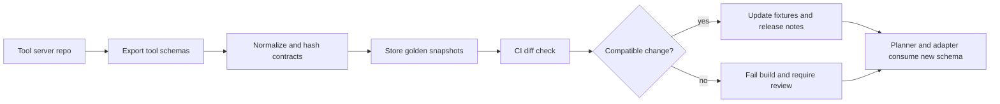

# Schema Drift Alerts for MCP Tools Before Agents Start Failing Weirdly

MCP tools rarely break in dramatic ways first. More often, a field becomes required, an enum tightens, a nested object moves, and the agent starts producing confusing repair loops or low-confidence retries. Everything still looks like JSON, but the contract has already changed.

If you run shared tool adapters, this is one of the most annoying failure classes in production. It looks like a reasoning problem until you inspect the tool schema history.

This post shows how to catch schema drift early with snapshot fixtures, contract hashes, compatibility lanes, and CI alerts. The goal is simple: treat MCP tool schemas like real APIs before agents pay the price.

## Why this matters

In an MCP setup, the schema is not documentation. It is execution policy. The model plans against it, the adapter validates against it, and your reviewers assume it still means what it meant yesterday.

A small schema change can cause several bad outcomes:

- the planner keeps calling an old parameter name
- retries become pointless because validation fails deterministically
- human approvals become misleading because the rendered preview no longer matches what the server expects
- a server-side default disappears and suddenly a formerly safe call becomes ambiguous

I would not wait for runtime errors alone. By the time logs show repeated validation failures, the drift has already escaped into real work.

## Architecture and workflow overview



A practical loop looks like this:

1. Export every tool schema from the MCP server.
2. Normalize unstable noise like key order and generated descriptions.
3. Hash the normalized contract.
4. Compare it against the checked-in snapshot.
5. Route the diff into a compatibility lane: additive, risky, or breaking.
6. Block merges for breaking changes unless the adapter and fixtures are updated together.

## Internal visual plan

- Hero image idea: dark contract dashboard with schema hash, fixture diff, and compatibility lane badges
- Diagram idea: schema export to normalization to CI gate to agent runtime
- Optional terminal visual: CI output showing one additive diff and one breaking diff
- Optional comparison table idea: additive vs risky vs breaking schema changes
- Tags: MCP, Tooling, Reliability, Contract Testing, AI Agents
- Meta description: A practical guide to catching MCP schema drift with fixture snapshots, contract hashes, compatibility lanes, and CI alerts before tool changes turn into silent agent regressions.
- Suggested code sections: schema normalization script, compatibility classifier, CI check command

## Implementation details

### 1) Snapshot the schemas you actually serve

Do not diff hand-written examples. Diff the exported schema payload that the agent really sees.

```bash
node scripts/export-mcp-schemas.mjs > .contracts/mcp-tools.raw.json
jq 'walk(if type == "object" then with_entries(sort_by(.key)) else . end)' \
  .contracts/mcp-tools.raw.json > .contracts/mcp-tools.normalized.json
shasum -a 256 .contracts/mcp-tools.normalized.json
```

The important bit is consistency. You want stable ordering and minimal noise so every diff means something.

Here is a tiny normalization script that strips volatile fields while preserving behaviorally meaningful ones:

```js
import fs from "node:fs";

const input = JSON.parse(fs.readFileSync(".contracts/mcp-tools.raw.json", "utf8"));

function normalize(node) {
  if (Array.isArray(node)) return node.map(normalize);
  if (!node || typeof node !== "object") return node;

  const allowed = {};
  for (const key of Object.keys(node).sort()) {
    if (["title", "examples", "$comment"].includes(key)) continue;
    allowed[key] = normalize(node[key]);
  }
  return allowed;
}

fs.writeFileSync(
  ".contracts/mcp-tools.normalized.json",
  JSON.stringify(normalize(input), null, 2) + "\n"
);
```

I would not strip descriptions if your planner relies on them for tool selection. In some teams, descriptions are behaviorally significant even when validation is not.

### 2) Classify schema diffs instead of treating every change the same

A new optional field is not the same as changing `required: ["path"]` to `required: ["path", "recursive"]`.

Use a compatibility classifier so your CI knows when to warn versus fail.

```ts
type DriftLane = "additive" | "risky" | "breaking";

export function classifyChange(before: any, after: any): DriftLane {
  if (JSON.stringify(before) === JSON.stringify(after)) return "additive";

  const beforeRequired = new Set(before.required ?? []);
  const afterRequired = new Set(after.required ?? []);

  for (const key of afterRequired) {
    if (!beforeRequired.has(key)) return "breaking";
  }

  if ((before.type && after.type) && before.type !== after.type) {
    return "breaking";
  }

  if (before.enum && after.enum) {
    const narrowed = before.enum.some((value: string) => !after.enum.includes(value));
    if (narrowed) return "breaking";
  }

  return "risky";
}
```

This is intentionally simple. You can extend it for nested object paths, union types, and response schemas. The useful part is giving reviewers a lane that matches the real blast radius.

### 3) Keep fixture calls next to schema snapshots

Golden transcripts catch behavioral drift, but fixture calls are faster and easier to review for contract drift.

```json
{
  "tool": "workspace.read",
  "input": {
    "path": "src/index.ts",
    "offset": 1,
    "limit": 50
  },
  "expectedValidation": "pass"
}
```

Then run those fixtures against the exported schema in CI. If a fixture that used to pass now fails validation, you have a very concrete regression signal.

```bash
pnpm tsx scripts/check-mcp-fixtures.ts \
  --schema .contracts/mcp-tools.normalized.json \
  --fixtures .contracts/fixtures
```

This catches the exact failure mode that annoys operators most: the tool still exists, but routine calls have become invalid.

### 4) Make CI output readable for humans

If the failure message is a raw structural diff, people will skim it and click rerun.

A better output format looks like this:

```text
Schema drift detected for tool: workspace.read
Lane: BREAKING
Reason:
  - new required field added: recursive
Fixtures affected:
  - read-basic.json: now fails validation
  - read-code-window.json: now fails validation
Recommended action:
  - restore backward compatibility OR
  - update adapter and fixtures in same PR
```

The point is to make the fix obvious. I want reviewers to know whether this is a safe additive change, a planner-affecting drift, or a hard contract break.

## Comparison table

| Change type | Example | Risk to agents | Suggested CI action |
| --- | --- | --- | --- |
| Additive | new optional field | low | warn, update snapshot |
| Risky | description changes that affect planner behavior | medium | require fixture review |
| Breaking | new required field, enum narrowing, type change | high | fail build |
| Hidden behavioral drift | same schema, different server-side default | high | catch with transcript tests |

This is why schema drift alerts are only one layer. They work best alongside transcript or replay tests for non-schema behavior.

## What went wrong, and tradeoffs

### Failure mode 1: normalizing away important meaning

Some teams remove descriptions, examples, and display labels to keep diffs small. That can hide real planner regressions. If your model depends on tool descriptions to choose between similar tools, description changes deserve at least the risky lane.

### Failure mode 2: trusting schema diffs too much

A perfectly unchanged schema can still break behavior if the server changes defaults, auth scopes, paging rules, or output structure. Schema drift checks are not a substitute for behavioral fixtures.

### Failure mode 3: no version story

If you cannot answer which agent adapter version consumed which schema snapshot, debugging gets messy fast. Store the schema hash in logs and release metadata. That one habit saves a lot of incident time.

### Security concern: drift can weaken approval semantics

If a tool starts accepting a broader parameter shape, the approval preview may stop reflecting the real server-side action surface. That is not just reliability drift. It is a safety boundary problem.

### Rough cost comparison

- snapshot and hash step: cheap, usually a few seconds in CI
- fixture validation: moderate, depends on fixture count
- transcript replay: heavier, but better at catching hidden behavioral drift

I like using all three, in that order, because they scale well from simple adapters to messy multi-tool servers.

## Best-practice checklist

- [ ] export schemas from the running server code, not docs
- [ ] normalize ordering and only strip truly volatile fields
- [ ] classify diffs into additive, risky, and breaking lanes
- [ ] keep validation fixtures beside the snapshot
- [ ] fail CI on breaking drift, not just runtime errors later
- [ ] log schema hashes with agent runs and incidents
- [ ] pair schema checks with behavioral transcript tests for critical tools

## What I would do again

If I were setting this up from scratch, I would start with three things only: normalized schema snapshots, a simple breaking-change classifier, and a small fixture pack for the top ten tool calls. That gets most of the value without building a giant framework first.

## Conclusion

MCP schema drift is boring right up until it burns a day of debugging and makes the model look flaky. Snapshot the contracts, diff them in CI, and make compatibility visible. Agents are much easier to trust when tool changes stop arriving as surprises.

## Links

- MCP: https://modelcontextprotocol.io/
- JSON Schema: https://json-schema.org/
- AJV: https://ajv.js.org/
- OpenTelemetry: https://opentelemetry.io/
