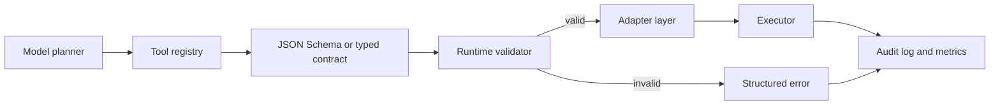

# Schema-First Tool Contracts for AI Agents That Fail Closed

Most agent failures I see are not model failures. They are contract failures.

The model picks the right tool in spirit, then sends one field with the wrong shape, one enum value with the wrong casing, or one half-parsed date that slips into a real side effect. If your executor is permissive, the bug moves downstream and becomes much harder to debug.

The fix is boring in a good way: make tool use schema-first. Define the tool contract once, validate at runtime, adapt provider-specific payloads at the edge, and fail closed when the request does not match the contract.

This matters because the minute an agent can create tickets, modify infra, touch customer data, or even just burn expensive API calls, loose contracts stop being a convenience problem and become a reliability problem.

## Visual plan

- **Hero image idea:** dark terminal-style banner with a tool-call file flowing through validation into execution
- **Architecture diagram idea:** planner → tool schema registry → validator → adapter → executor → audit log
- **Optional terminal visual:** validation error showing a rejected enum and missing required field
- **Optional comparison table:** loose JSON vs schema-first tool contracts
- **Tags:** AI Agents, Tool Calling, JSON Schema, Reliability, Developer Workflow
- **Meta description:** A practical guide to building schema-first tool contracts for AI agents with JSON Schema, runtime validation, adapter layers, and fail-closed execution paths that keep tool use reliable and reviewable.
- **Suggested code sections:** JSON Schema definition, TypeScript runtime validator and adapter, Python fail-closed executor

## Architecture or workflow overview



A good tool path has five distinct parts:

1. **Planner** decides which tool to call.
2. **Registry** describes allowed tools and their exact input shape.
3. **Validator** rejects malformed arguments before execution.
4. **Adapter** converts schema-safe arguments into provider or service specific calls.
5. **Executor** performs the side effect and records exactly what happened.

The subtle but important point is that the adapter is not the schema. The schema should stay stable even if the downstream API changes.

## Implementation details

### 1. Define the contract in one place

A minimal tool contract should be explicit about required fields, enums, bounds, and whether additional properties are allowed.

```json
{
  "$schema": "https://json-schema.org/draft/2020-12/schema",
  "title": "CreateIncidentTicket",
  "type": "object",
  "additionalProperties": false,
  "required": ["service", "severity", "summary"],
  "properties": {
    "service": { "type": "string", "minLength": 2 },
    "severity": {
      "type": "string",
      "enum": ["sev1", "sev2", "sev3", "sev4"]
    },
    "summary": { "type": "string", "minLength": 10, "maxLength": 240 },
    "runbook_url": { "type": "string", "format": "uri" },
    "notify_slack": { "type": "boolean", "default": true }
  }
}
```

Three things here matter more than people expect:

- `additionalProperties: false` stops hallucinated fields from silently leaking into execution.
- bounded strings prevent giant prompt spillover from landing in audit systems or tickets.
- enums force the agent onto your operating vocabulary instead of its own.

### 2. Validate before any side effect

In a TypeScript service, I like to keep the registry typed and compile validators up front.

```ts
import Ajv from "ajv";
import addFormats from "ajv-formats";
import schema from "./schemas/create-incident-ticket.json";

const ajv = new Ajv({ allErrors: true, useDefaults: true, removeAdditional: false });
addFormats(ajv);

const validateCreateIncident = ajv.compile(schema);

type ToolCall = {
  name: string;
  arguments: unknown;
};

export function parseToolCall(call: ToolCall) {
  if (call.name !== "create_incident_ticket") {
    throw new Error(`unsupported tool: ${call.name}`);
  }

  if (!validateCreateIncident(call.arguments)) {
    return {
      ok: false,
      error: "validation_failed",
      details: validateCreateIncident.errors ?? []
    };
  }

  return {
    ok: true,
    args: call.arguments as {
      service: string;
      severity: "sev1" | "sev2" | "sev3" | "sev4";
      summary: string;
      runbook_url?: string;
      notify_slack: boolean;
    }
  };
}
```

This is the difference between *tool calling as best effort* and *tool calling as a controlled interface*. If validation fails, the executor never runs.

### 3. Adapt clean arguments to the downstream API

Provider APIs drift. Internal APIs drift too. The adapter layer is where drift should live.

```python
from dataclasses import dataclass
from typing import Optional

@dataclass(frozen=True)
class CreateIncidentTicket:
    service: str
    severity: str
    summary: str
    runbook_url: Optional[str] = None
    notify_slack: bool = True

SEVERITY_MAP = {
    "sev1": "critical",
    "sev2": "high",
    "sev3": "medium",
    "sev4": "low",
}

def to_ticket_payload(cmd: CreateIncidentTicket) -> dict:
    return {
        "service_name": cmd.service,
        "priority": SEVERITY_MAP[cmd.severity],
        "title": cmd.summary,
        "references": [cmd.runbook_url] if cmd.runbook_url else [],
        "notify": {"slack": cmd.notify_slack},
    }
```

If the ticket provider later renames `priority` to `urgency`, you update one adapter instead of retraining prompts and hoping every call path changes with it.

### 4. Return machine-readable errors back to the model

When validation fails, do not send back a vague sentence like “that did not work.” Return a precise structured error so the planner can repair the call.

```json
{
  "ok": false,
  "error": "validation_failed",
  "tool": "create_incident_ticket",
  "details": [
    {
      "path": "/severity",
      "message": "must be equal to one of the allowed values",
      "allowed": ["sev1", "sev2", "sev3", "sev4"]
    },
    {
      "path": "/summary",
      "message": "must NOT have fewer than 10 characters"
    }
  ]
}
```

That repair loop is where a lot of real reliability comes from. Agents do not need perfection on the first try, but they do need crisp boundaries.

## Loose JSON vs schema-first contracts

| Approach | What feels nice at first | What breaks later | Better default |
| --- | --- | --- | --- |
| Free-form JSON arguments | Fast prototyping | silent field drift, weak reviewability, awkward retries | only for throwaway prototypes |
| Prompt-only tool instructions | low setup cost | models invent values and formats | use only as additional guidance |
| Schema-first contracts | slightly more upfront work | much lower runtime ambiguity | best default for anything with side effects |
| Schema + adapter + audit log | highest discipline | more boilerplate | best choice for production or shared agents |

## What went wrong and what I would not do

### Failure mode 1: trusting the provider SDK to validate enough

A lot of provider SDKs validate only the transport shape, not your business rules. That means a request can be syntactically valid and still operationally wrong.

I would not depend on downstream 400s as my validation layer. By then you have already mixed tool execution concerns with API-specific failure handling.

### Failure mode 2: using one schema for both model planning and downstream execution

This creates fragile contracts. Your model wants a stable and understandable interface. Your downstream service wants whatever weird field names it happens to use this quarter.

Keep those separate.

### Failure mode 3: accepting partial execution with best-effort coercion

Auto-coercing `SEV-1` into `sev1` looks helpful until the same logic starts coercing values you should have rejected. I am okay with explicit normalization in the adapter for very narrow cases, but not with a general “make it work somehow” layer.

## Pitfalls to watch for

> **Pitfall:** If you let tools accept arbitrary strings for dates, IDs, or environments, the model will eventually generate one that looks plausible and is wrong. Prefer enums, typed IDs, and narrow patterns.

> **Security note:** Schema validation is not a substitute for authorization. A perfectly valid tool call can still be unauthorized for the current user, environment, or workflow step.

## Practical checklist

- Define tool inputs once in JSON Schema, Zod, Pydantic, or a similarly typed format.
- Reject unknown fields unless you have a very strong migration reason not to.
- Keep the model-facing contract separate from the downstream API payload.
- Return structured validation errors so the agent can repair bad calls.
- Log validated arguments, execution result, and error category for every run.
- Add auth checks after validation and before side effects.
- Add replay-safe identifiers or idempotency keys for non-read tools.
- Review every enum and default value like it is part of your public API, because it is.

## References

- [OpenAI, structured outputs](https://platform.openai.com/docs/guides/structured-outputs)
- [Anthropic, tool use](https://docs.anthropic.com/en/docs/agents-and-tools/tool-use/overview)
- [JSON Schema specification](https://json-schema.org/specification)
- [Ajv JSON Schema validator](https://ajv.js.org/)
- [Pydantic](https://docs.pydantic.dev/latest/)

## Conclusion

If an agent can touch real systems, tool calling should look more like API design and less like wishful prompting.

Schema-first contracts add a little ceremony, but they buy calmer debugging, safer retries, tighter reviews, and fewer bizarre side effects. That is a trade I would make every time.
