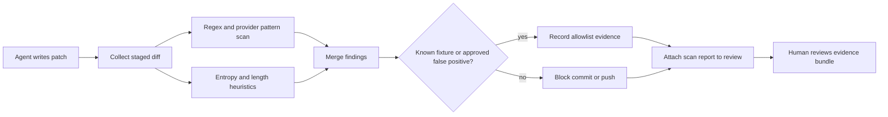

# Secret Scanning Gates for AI-Generated Patches Before They Leave the Repo

## Hook

AI coding agents are good at moving fast through boring glue work. They are also good at reproducing whatever token-shaped string happened to be sitting in a test fixture, `.env` sample, terminal transcript, or copied debug log.

That makes secret leaks a workflow problem, not just a developer typo problem. If your only defense is “someone will notice in code review,” you are already too late.

This post shows how I would add a secret-scanning gate in front of AI-generated patches using diff-only scans, fixture-aware allowlists, push protection mirrors, and reviewer evidence bundles.

## Why this matters

Credential leaks have an ugly shape in agent workflows:

- generated patches can touch many files quickly
- copied stack traces often contain bearer tokens or signed URLs
- AI can normalize suspicious values into config examples that look legitimate
- automated pushes shrink the time between mistake and exposure

A good gate does not need perfect detection. It needs to catch the obvious leaks early, make suppressions explicit, and leave a clear audit trail when something is allowed through.

## Architecture or workflow overview



The important design choice is scanning the outgoing change set, not the whole repository on every run. Full-repo scans still matter, but the fast gate should be centered on what the agent just introduced.

## Implementation details

### 1) Scan the staged diff first

A diff-only gate gives you faster feedback and fewer noisy historical findings.

```bash
git diff --cached --unified=0 --no-color   | detect-secrets-hook --stdin --baseline .secrets.baseline
```

If the repo does not use `detect-secrets`, the same pattern still applies with `gitleaks` or a custom wrapper.

```bash
gitleaks detect   --no-git   --source .   --report-format sarif   --report-path build/secret-scan.sarif   --log-level warn
```

The trick is not the brand name. It is making the gate cheap enough that people keep it enabled.

### 2) Separate hard provider matches from softer entropy hits

Not every high-entropy string is a secret. Session IDs, compressed test blobs, and fixture hashes can look suspicious.

```python
from dataclasses import dataclass
import math
import re

AWS_KEY = re.compile(r"AKIA[0-9A-Z]16")
GITHUB_PAT = re.compile(r"ghp_[A-Za-z0-9]36")

@dataclass
class Finding:
    kind: str
    value: str
    path: str
    line: int
    confidence: str


def shannon_entropy(text: str) -> float:
    probs = [text.count(ch) / len(text) for ch in set(text)]
    return -sum(p * math.log2(p) for p in probs)
```

Provider-specific signatures should usually block immediately. Entropy-only findings should require more context, especially in test data or generated fixtures.

### 3) Make allowlists narrow and reviewable

The worst secret scanning setup is one giant ignore file nobody trusts.

```yaml
allowlist:
  paths:
    - tests/fixtures/**
    - docs/examples/**
  regexes:
    - 'example_(token|secret|apikey)'
  reviewers:
    - security-team
  maxAgeDays: 30
```

A short-lived allowlist forces teams to rejustify noisy exceptions instead of quietly accumulating permanent blind spots.

### 4) Produce a reviewer evidence bundle

If a gate blocks a push, the reviewer needs context, not just a red X.

```json
{
  "scanTarget": "staged-diff",
  "commit": "HEAD",
  "findings": [
    {
      "path": "config/dev.env.example",
      "line": 14,
      "kind": "provider-pattern",
      "rule": "github_pat",
      "confidence": "high",
      "action": "blocked"
    }
  ],
  "allowlistMatches": [],
  "tool": "secret-gate@1.4.0"
}
```

That report can feed CI annotations, PR comments, or an artifact link for reviewers.

## What went wrong / tradeoffs

### Failure mode 1: the scanner runs too late

If the first scan happens after `git push`, incident response just got harder. The best place for the fast gate is pre-commit or pre-push, with CI enforcing the same policy server-side.

### Failure mode 2: entropy heuristics create alert fatigue

Teams disable noisy scanners. I would rather miss a few medium-confidence entropy hits than train everyone to ignore every finding. Provider-specific patterns plus diff context give a much better signal floor.

### Failure mode 3: allowlists become a hiding place

A path-level exclusion for `tests/**` is convenient and dangerous. Real secrets leak into tests all the time. Prefer line-scoped or file-scoped suppressions with expiration.

<div class="callout"><strong>Pitfall:</strong> AI agents often copy terminal output into markdown docs or example config blocks. Those docs are public-facing more often than source files, so documentation changes deserve the same secret gate as application code.</div>

<table>
  <thead><tr><th>Approach</th><th>Upside</th><th>Downside</th><th>Best fit</th></tr></thead>
  <tbody>
    <tr><td>Full repo scan on every run</td><td>Finds historical leaks too</td><td>Slow and noisy</td><td>Nightly or scheduled audit</td></tr>
    <tr><td>Diff-only pre-push gate</td><td>Fast, actionable</td><td>Can miss old secrets already in repo</td><td>Default agent workflow</td></tr>
    <tr><td>Provider pattern only</td><td>High precision</td><td>Misses custom tokens</td><td>Strict low-noise lanes</td></tr>
    <tr><td>Pattern + entropy + review evidence</td><td>Best coverage balance</td><td>Needs tuning and ownership</td><td>Most engineering teams</td></tr>
  </tbody>
</table>

## Practical checklist or decision framework

<div class="callout"><strong>What I would do again</strong><br>
- scan staged diffs locally before any automated push<br>
- enforce the same rules again in CI so bypasses do not stick<br>
- treat provider-pattern matches as hard blocks by default<br>
- keep allowlists narrow, expiring, and tied to a reviewer<br>
- attach a small machine-readable evidence bundle to failed runs<br>
- run a slower full-repo audit on a schedule to catch historical debt<br>
- include docs, examples, and generated config in the same gate
</div>

## References

- [Gitleaks](https://github.com/gitleaks/gitleaks)
- [Yelp detect-secrets](https://github.com/Yelp/detect-secrets)
- [GitHub push protection](https://docs.github.com/en/code-security/secret-scanning/push-protection-for-repositories-and-organizations)
- [OWASP Secrets Management Cheat Sheet](https://cheatsheetseries.owasp.org/cheatsheets/Secrets_Management_Cheat_Sheet.html)

## Conclusion

Secret scanning for AI-generated patches should feel boring. That is the goal. Scan the diff, block obvious leaks, make suppressions visible, and leave reviewers with proof instead of guesswork.
