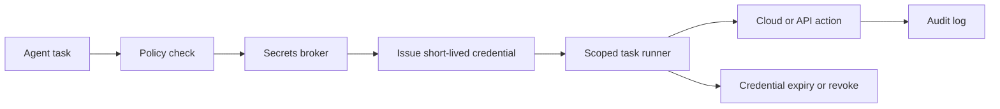

# Secrets Management for AI Agents Without Handing Them the Kingdom

Most AI agent security mistakes are boring. A shell inherits `AWS_SECRET_ACCESS_KEY`. A build bot gets a production token because it was convenient once. A prompt log quietly captures credentials that were supposed to stay in memory for one minute.

That is usually not an intelligence problem. It is a secrets plumbing problem. If the agent can read every long-lived secret by default, the model does not need to be malicious to become dangerous. It just needs one prompt leak, one bad tool wrapper, or one over-helpful debug trace.

The fix is not to make agents useless. It is to stop treating them like a person logged into everything. In this post I will show the setup I would use instead: brokered access, short-lived credentials, scoped injection, and audit-friendly execution.

## Why this matters

Agent workflows often touch real systems: CI, cloud storage, package registries, staging clusters, issue trackers, and deployment pipelines. The tempting design is to preload all of that access into environment variables and let the agent sort it out.

That design fails in predictable ways:

1. the agent sees more than the task needs
2. secrets leak into logs, prompts, or artifacts
3. long-lived credentials survive after the task ends
4. operators cannot explain who used what and why

A better pattern is to give the agent **claims** and **approval context**, not raw standing power. The runtime should exchange those claims for narrowly scoped credentials only when the task actually reaches the step that needs them.

## Architecture or workflow overview

The mental model I like is: request capability, broker access, inject briefly, revoke aggressively.



### What belongs where

| Layer | Responsibility | Good examples | What I would avoid |
| --- | --- | --- | --- |
| Agent plan | Ask for the capability it needs | `deploy-preview`, `read-ci-artifacts` | Raw passwords, API keys in prompts |
| Policy engine | Decide whether the request is allowed | repo, branch, environment, human approval | Hidden allowlists buried in tool code |
| Secrets broker | Exchange claims for short-lived credentials | Vault, cloud STS, workload identity | Static `.env` files shared across jobs |
| Scoped runner | Inject creds only into the one step that needs them | one subprocess, one container, one job | Global shell sessions with inherited env |
| Audit trail | Record who requested access and what happened | task id, repo, scope, TTL | Silent secret reads with no trace |

My strong preference is to keep secrets out of model context entirely. The agent can request `deploy-preview`, but the runtime should translate that into a broker call. The model should never need to compose or inspect the actual token.

## Implementation details

### 1. Ask for capabilities, not secret names

If the agent asks for `AWS_PROD_KEY`, the abstraction is already too low-level. Ask for a capability that the policy layer understands.

```python
from dataclasses import dataclass
from typing import Literal

@dataclass
class CapabilityRequest:
    task_id: str
    repo: str
    actor: str
    capability: Literal[
        "read-ci-artifacts",
        "publish-preview-build",
        "read-staging-metrics",
        "rotate-cache-key",
    ]
    justification: str
    ttl_seconds: int = 900
```

This gives you something reviewable. Humans and policies can reason about `publish-preview-build`. They should not need to reason about whether a specific secret path in a vault is safe for a model to read.

### 2. Let a broker mint short-lived credentials

The broker should map approved capabilities to real backend auth. That might be Vault dynamic secrets, AWS STS, GCP workload identity, GitHub OIDC, or a custom internal token issuer.

```ts
import { randomUUID } from "node:crypto";

type CapabilityGrant = {
  capability: "publish-preview-build" | "read-ci-artifacts";
  repo: string;
  actor: string;
  ttlSeconds: number;
};

export async function issueBrokeredCredential(grant: CapabilityGrant) {
  const leaseId = randomUUID();

  if (grant.capability === "publish-preview-build") {
    return {
      leaseId,
      provider: "aws-sts",
      expiresIn: grant.ttlSeconds,
      scope: ["s3:PutObject", "cloudfront:CreateInvalidation"],
      credentials: await exchangeOidcForAwsRole({
        roleArn: "arn:aws:iam::123456789012:role/preview-deployer",
        sessionName: `agent-${leaseId}`,
        ttlSeconds: grant.ttlSeconds,
      }),
    };
  }

  return {
    leaseId,
    provider: "artifact-proxy",
    expiresIn: grant.ttlSeconds,
    scope: ["artifacts:read"],
    credentials: await mintArtifactReadToken(grant),
  };
}
```

The important part is that this broker is server-side policy, not prompt convention. If the agent asks for too much, the broker can say no, shorten TTL, or require fresh approval.

### 3. Inject credentials into one step, then drop them

A lot of leaks happen because credentials are injected into the parent process and every child inherits them. That is lazy plumbing, and it tends to show up later in debug logs or shell history.

```python
import os
import subprocess
from contextlib import contextmanager

@contextmanager
def scoped_env(temp_values: dict[str, str]):
    original = os.environ.copy()
    try:
        os.environ.clear()
        os.environ.update(original)
        os.environ.update(temp_values)
        yield
    finally:
        os.environ.clear()
        os.environ.update(original)
        for key in temp_values:
            os.environ.pop(key, None)


def run_preview_publish(creds: dict[str, str]) -> int:
    with scoped_env({
        "AWS_ACCESS_KEY_ID": creds["accessKeyId"],
        "AWS_SECRET_ACCESS_KEY": creds["secretAccessKey"],
        "AWS_SESSION_TOKEN": creds["sessionToken"],
    }):
        result = subprocess.run(
            ["./scripts/publish-preview.sh"],
            check=False,
            capture_output=True,
            text=True,
        )
    return result.returncode
```

I would still prefer a subprocess-specific environment map over mutating `os.environ`, but even this is safer than exporting credentials into a long-lived interactive shell.

### 4. Prefer OIDC and workload identity over stored cloud keys

If your agent runs inside GitHub Actions, Kubernetes, or another trusted workload platform, use identity federation instead of checking cloud keys into secret stores just because it is familiar.

```yaml
name: preview-deploy
on:
  workflow_dispatch:
permissions:
  id-token: write
  contents: read
jobs:
  deploy-preview:
    runs-on: ubuntu-latest
    steps:
      - uses: actions/checkout@v4
      - name: Configure AWS credentials
        uses: aws-actions/configure-aws-credentials@v4
        with:
          role-to-assume: arn:aws:iam::123456789012:role/preview-deployer
          aws-region: us-east-1
          role-session-name: ai-agent-preview
      - name: Publish preview
        run: ./scripts/publish-preview.sh
```

That still needs policy controls, but it removes one entire class of problems: long-lived cloud keys sitting around waiting to leak.

### 5. Log capability grants like production events

Operators should be able to answer these questions quickly:

- Which task requested the credential?
- Which repo and environment was involved?
- Was there a human approval step?
- What scope and TTL were issued?
- Was the lease revoked, expired, or reused?

A minimal audit record is enough to save hours later.

```json
{
  "timestamp": "2026-05-09T11:48:00Z",
  "task_id": "cron-blog-run-2026-05-09",
  "actor": "openclaw-agent",
  "repo": "negiadventures.github.io",
  "capability": "publish-preview-build",
  "lease_id": "9f8c6b6a-9c2a-4e0b-8a4d-2d7db8f80731",
  "provider": "aws-sts",
  "scope": ["s3:PutObject", "cloudfront:CreateInvalidation"],
  "ttl_seconds": 900,
  "approval": "granted",
  "outcome": "expired_without_reuse"
}
```

### Terminal view: what healthy brokered access looks like

```text
$ agent run "publish the preview build for PR-184"
policy.check        capability=publish-preview-build repo=web-app env=preview approval=required
policy.result       approved=true ttl_seconds=900
broker.issue        provider=aws-sts scope=s3:PutObject,cloudfront:CreateInvalidation
runner.exec         step=publish-preview.sh env_scope=subprocess-only
broker.revoke       lease_id=9f8c6b6a status=expired
```

If your logs only say `loaded env vars`, you are going to hate your next incident review.

## What went wrong and the tradeoffs

### Failure mode 1: secrets leaked into prompts through error reporting

An agent tool wrapper caught a failing command, dumped the full environment for debugging, then sent that text back into model context. Nobody intended to exfiltrate anything. The tool just had bad defaults.

> **Pitfall:** debug helpers often become secret exporters. Treat stderr capture, exception objects, and trace dumps as tainted output.

### Failure mode 2: long-lived fallback creds became the real path

Teams sometimes add a clean broker path, then leave old static credentials in place just in case. The result is predictable: the fallback becomes permanent, because it is easier.

> **Best practice:** remove or sharply degrade the fallback path once brokered access works. A backup that is always simpler than the safe path is not a backup, it is your actual design.

### Failure mode 3: scoped credentials still had the wrong scope

A short-lived token with administrator access is still bad. TTL limits blast radius, but it does not fix overbroad permissions.

### Failure mode 4: revocation was assumed, not verified

Some systems do not truly revoke issued credentials. They just wait for TTL expiry. That is fine if the TTL is tiny and the action is bounded. It is not fine if the lease lasts an hour and can be replayed.

### Tradeoff table

| Choice | Upside | Downside | My default |
| --- | --- | --- | --- |
| Static shared secrets | Easy to set up | Large blast radius, weak auditability | Avoid |
| Vault-style dynamic secrets | Tight TTL and leasing | Extra broker complexity | Good for DBs and internal services |
| OIDC or workload identity | No stored cloud key | Setup can be fussy | Best for cloud access |
| Inject into parent shell | Fast to wire | Leaks into children and logs | Avoid |
| Subprocess-only injection | Better containment | Slightly more plumbing | Default |
| Broad admin role | Fewer policy edge cases | Too much power for mistakes | Avoid |
| Capability-specific roles | Safer review and audit | More IAM work upfront | Default |

## Practical checklist

- [ ] Replace secret-name requests with capability requests
- [ ] Issue short-lived credentials from a broker or workload identity layer
- [ ] Keep credentials out of prompts, markdown artifacts, and plan logs
- [ ] Inject secrets only into the subprocess or container that needs them
- [ ] Use repo, environment, and approval context in policy decisions
- [ ] Prefer capability-specific roles over generic admin roles
- [ ] Record lease id, scope, TTL, and outcome in an audit log
- [ ] Scrub debug output and exception traces for environment leakage
- [ ] Remove convenient static fallbacks once the broker path is stable

## What I would and would not do

I would absolutely let an agent request a deployment capability, fetch CI artifacts, or rotate a narrowly scoped cache token when the workflow is brokered and logged.

I would not let the model inspect a vault path tree, read a `.env.production` file, or carry a cloud admin key around for convenience. That kind of convenience is usually just delayed incident work.

## Conclusion

Secrets management for AI agents gets much simpler when you stop asking, “How do I hide the key better?” and start asking, “Why does this run need a key at all, and can I mint one that dies quickly?”

That shift is the difference between a useful automation system and a very fast way to spread standing access everywhere.

## References

- [HashiCorp Vault dynamic secrets](https://developer.hashicorp.com/vault/docs/secrets)
- [AWS STS temporary security credentials](https://docs.aws.amazon.com/IAM/latest/UserGuide/id_credentials_temp.html)
- [GitHub Actions OIDC hardening](https://docs.github.com/en/actions/deployment/security-hardening-your-deployments/about-security-hardening-with-openid-connect)
- [Google Cloud workload identity federation](https://cloud.google.com/iam/docs/workload-identity-federation)
