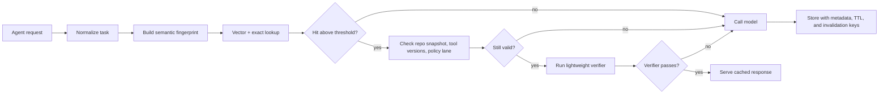

# Semantic Caching for AI Coding Agents Without Serving Stale Bugs

Semantic caching looks like free performance until it replays yesterday's answer into today's repository. That is where a lot of agent setups get into trouble. A fast wrong answer is often worse than a slow fresh one.

The useful version of semantic caching is not "vector search, but for prompts." It is a narrow reuse layer that understands task shape, repo state, tool versions, and trust boundaries. If those inputs drift, the cache should miss on purpose.

In this post I will show how I would wire a semantic cache for coding agents so it actually helps. The goal is lower latency and lower model spend without reusing stale plans, leaking cross-repo context, or letting cached tool results bypass verification.

## Why this matters

Coding agents repeat themselves more than people expect. They summarize the same stack traces, explain the same build failures, restate the same repo instructions, and regenerate similar patch plans for similar files. If every one of those calls goes back to the model, latency and cost climb fast.

The catch is that code tasks are not static. A small commit, dependency bump, or changed tool contract can turn a previously correct answer into a misleading one. That makes semantic caching a production reliability problem, not just an optimization trick.

A cache for coding agents needs to answer four questions before it serves a hit:

1. Is this really the same task?
2. Is the repository state close enough?
3. Did the dependency or tool contract change?
4. Does this response still need verification before reuse?

## Architecture and workflow overview

A safe mental model is: retrieve candidate, validate fingerprint, verify freshness, then reuse.



The important part is that the semantic index is only the first gate. Similarity gets you a candidate. It does not give you permission to trust it.

### Practical cache layers

| Layer | Good for | What I would cache | Main risk |
| --- | --- | --- | --- |
| Prefix or provider prompt cache | Large repeated system prompts and repo instructions | Stable instruction blocks | Limited control over semantic correctness |
| Semantic response cache | Repeated explanations, plans, summaries, and low-risk code assists | Natural-language outputs with narrow scope | Stale answers after repo drift |
| Tool-result cache | Expensive read-only tool calls like repo maps or symbol graphs | Deterministic read outputs | Hidden dependence on changed files |
| Patch cache | Almost never by default | Tiny boilerplate transforms only | Replaying wrong edits into changed code |

My bias is simple: cache summaries and diagnostics aggressively, cache code edits cautiously, and cache side-effecting tool results almost never.

## Implementation details

### 1. Build a fingerprint that is more than prompt text

A prompt-only hash misses the thing that matters most in coding workflows: the surrounding state. I would fingerprint a request from normalized task inputs plus a small repo snapshot.

```python
from __future__ import annotations

import hashlib
import json
from pathlib import Path
from typing import Iterable


def sha256_text(value: str) -> str:
    return hashlib.sha256(value.encode("utf-8")).hexdigest()


def build_repo_snapshot(repo_root: Path, files: Iterable[str]) -> dict:
    snapshot = {}
    for rel in sorted(set(files)):
        path = repo_root / rel
        if not path.exists():
            snapshot[rel] = {"exists": False}
            continue
        text = path.read_text(encoding="utf-8", errors="ignore")
        snapshot[rel] = {
            "exists": True,
            "sha256": sha256_text(text),
            "bytes": len(text.encode("utf-8")),
        }
    return snapshot


def semantic_fingerprint(task: dict, repo_snapshot: dict, tool_versions: dict) -> str:
    payload = {
        "intent": task["intent"],
        "language": task.get("language"),
        "error_class": task.get("error_class"),
        "paths": sorted(task.get("paths", [])),
        "constraints": sorted(task.get("constraints", [])),
        "repo_snapshot": repo_snapshot,
        "tool_versions": tool_versions,
        "policy_lane": task.get("policy_lane", "default"),
    }
    canonical = json.dumps(payload, sort_keys=True, separators=(",", ":"))
    return sha256_text(canonical)
```

This is intentionally picky. If the repo snapshot or tool versions change, I want the cache key to change too. That hurts hit rate a bit, but it protects correctness where it matters.

### 2. Store retrieval metadata, not just the answer

If you only store the final text, you lose the context needed to decide whether a hit is safe. A usable entry needs its own small audit record.

```json
{
  "fingerprint": "d9c8...",
  "embedding_key": "plan-debug-webpack-build",
  "task_class": "build_failure_summary",
  "repo": "negiadventures.github.io",
  "branch": "master",
  "created_at": "2026-05-08T11:40:00Z",
  "ttl_seconds": 21600,
  "tool_versions": {
    "node": "22.22.1",
    "eslint": "9.2.0"
  },
  "watched_paths": [
    "package.json",
    "package-lock.json",
    "webpack.config.js",
    "src/components/Header.tsx"
  ],
  "verification": {
    "required": true,
    "kind": "lightweight"
  },
  "response": {
    "summary": "ESM import mismatch caused the build failure",
    "actions": [
      "rename config to webpack.config.mjs",
      "update import path aliases"
    ]
  }
}
```

The watched paths become your invalidation hooks. If one of them changes, the entry should miss even if the semantic similarity still looks high.

### 3. Separate low-risk reuse from high-risk reuse

Not every cached response deserves the same trust lane. I like a simple policy split:

- **Low risk**: summaries, explanations, stack-trace classification, command suggestions
- **Medium risk**: refactor plans, test recommendations, migration checklists
- **High risk**: concrete patches, deployment commands, schema-changing edits

Only low-risk items should be reusable with lightweight verification. Medium-risk items usually need a fresh repo snapshot check and a short verifier. High-risk items should often fall through to a fresh generation, even when the semantic match is strong.

### 4. Verify the hit before serving it

The verifier can be small. That is the nice part. You do not need a second full model pass every time. You need a cheap guard that checks whether the assumptions behind the cached answer still hold.

```ts
import { execFile } from "node:child_process";
import { promisify } from "node:util";

const execFileAsync = promisify(execFile);

type CacheEntry = {
  watchedPaths: string[];
  toolVersions: Record<string, string>;
  verification: { required: boolean; kind: "none" | "lightweight" | "strict" };
};

export async function verifyCacheHit(entry: CacheEntry): Promise<boolean> {
  if (!entry.verification.required) return true;

  const { stdout } = await execFileAsync("git", ["diff", "--name-only", "HEAD~1", "HEAD"]);
  const changed = new Set(stdout.split("
").filter(Boolean));

  for (const path of entry.watchedPaths) {
    if (changed.has(path)) return false;
  }

  if (entry.verification.kind === "strict") {
    const checks = [
      execFileAsync("npm", ["run", "lint", "--", "--quiet"]),
      execFileAsync("npm", ["test", "--", "--runInBand", "affected"]),
    ];
    const results = await Promise.allSettled(checks);
    return results.every((result) => result.status === "fulfilled");
  }

  return true;
}
```

This example is intentionally boring. That is a good thing. Cache safety usually comes from boring checks tied to real repository signals, not from clever embedding math.

### 5. Cache tool outputs with explicit invalidation keys

Tool-result caching is underrated. Repo maps, dependency graphs, and symbol indexes are often expensive to regenerate but deterministic enough to cache safely if you bind them to the right files.

A symbol graph cache tied to `tsconfig.json`, `package-lock.json`, and all `src/**/*.ts` hashes is much easier to reason about than a cached patch suggestion. Start there.

### Terminal view: what a good hit should look like

```text
$ agent run "explain why lint fails on CI but not locally"
cache.lookup        candidate_score=0.94 task_class=lint_failure_summary
cache.validate      repo_snapshot=match tool_versions=match policy_lane=low-risk
cache.verify        watched_paths_clean=true verifier=lightweight
cache.result        HIT latency_ms=74 saved_model_call=true
```

If you cannot explain a cache hit in logs that cleanly, your operators will have a miserable time debugging reuse mistakes.

## What went wrong and the tradeoffs

### Failure mode 1: cache hits survived dependency bumps

This is the classic mistake. The request looked the same, but a minor dependency release changed build behavior. The cached explanation kept pointing engineers toward the old fix.

**Fix:** include lockfiles and tool versions in the fingerprint, and expire build-related entries quickly.

### Failure mode 2: semantically similar does not mean operationally identical

Two TypeScript errors can look almost identical while coming from very different causes. If one lives in a generated file and the other in a hand-written adapter, the right next step may be completely different.

**Fix:** include task class and watched paths, not just an embedding score.

### Failure mode 3: cached plans leaked across trust boundaries

A cache shared between repos or teams can quietly turn into a context leak. This is especially ugly if prompts contain internal architecture notes or file paths.

**Fix:** scope entries by repo, branch family, tenant, and policy lane. Never let a semantic hit cross those boundaries.

### Failure mode 4: aggressive caching made humans trust the agent too much

Fast answers feel authoritative. Teams stop noticing that they are reading reused advice.

**Fix:** surface cache provenance. Show when the answer was cached, what it depended on, and why it was considered safe to reuse.

### Rough tradeoff table

| Choice | Upside | Downside | My default |
| --- | --- | --- | --- |
| Long TTLs | Better hit rate | More stale answers | Short TTLs for code tasks |
| Broad semantic matching | More reuse | Wrong-task collisions | Narrow task-class matching |
| Shared cache across repos | Lower cost | Context leakage risk | No cross-repo reuse |
| Cache patch outputs | Fast edits | High correctness risk | Avoid unless boilerplate |
| No verifier | Lowest latency | Silent bad hits | Always verify anything non-trivial |

> **Pitfall:** Do not count all cache hits as wins. A hit that still needs escalation or re-verification may save tokens, but it can still cost engineer attention. Track usefulness, not just hit rate.

> **Best practice:** Keep separate metrics for cache hit rate, verifier pass rate, stale-hit rejection rate, and model-cost saved. One blended "cache efficiency" number will hide the exact failure you need to fix.

## Practical checklist

Use this checklist if you are adding semantic caching to a coding agent this week:

- [ ] Start with read-only tasks like summaries, diagnostics, and repo maps
- [ ] Include repo snapshot data, tool versions, and policy lane in the fingerprint
- [ ] Scope cache entries to a single repo and trust boundary
- [ ] Add watched-path invalidation for lockfiles, config files, and affected sources
- [ ] Require a verifier for anything that changes engineering decisions
- [ ] Keep TTLs short for build, test, and migration related outputs
- [ ] Log cache provenance so operators can see why a hit was served
- [ ] Track stale-hit rejection rate, not just hit rate
- [ ] Avoid caching concrete patches unless the transform is tiny and deterministic

## What I would and would not do

I would absolutely cache stack-trace summaries, repeated repo instructions, and deterministic tool outputs like symbol maps. Those are high-frequency and low-drama.

I would not cache migration patches, deployment commands, or broad refactor plans without a strict verifier. The speedup is real, but so is the blast radius when the cached answer is slightly out of date.

## Conclusion

Semantic caching for coding agents works best when it behaves like a suspicious teammate. It should ask whether the task is really the same, whether the repo is still in the same shape, and whether the answer still deserves trust.

That makes the cache a little less magical, but much more useful.

## References

- [Anthropic prompt caching docs](https://docs.anthropic.com/en/docs/build-with-claude/prompt-caching)
- [OpenAI prompt caching overview](https://platform.openai.com/docs/guides/prompt-caching)
- [Redis semantic caching pattern](https://redis.io/docs/latest/solutions/ai/semantic-caching/)
- [Martin Fowler on feature toggles and operational safety patterns](https://martinfowler.com/articles/feature-toggles.html)
