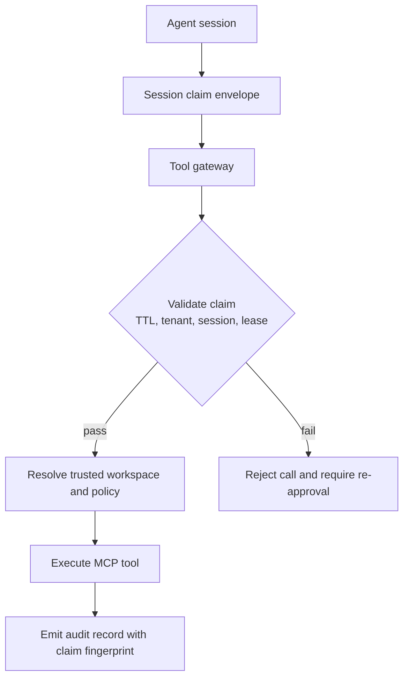

# Session-Aware MCP Tools for Multi-User Agent Systems

Session-aware tools become mandatory the moment one MCP server is shared across multiple users, multiple repos, or multiple long-lived agent sessions.

The easy version of a tool server just validates input and runs the action. The painful version comes later, when a perfectly valid tool call uses the wrong workspace, replays an old approval, or writes a note into somebody else’s thread because the runtime forgot who the caller actually was.

This post walks through the design pattern I would use: bind every tool call to a session claim, resolve tenant and workspace server-side, scope leases tightly, and make the audit trail survive past the model turn.

## Why this matters

A lot of MCP demos assume a single human, a single workspace, and a short-lived interaction. Production setups are not that polite.

Once a server is shared, the failure modes change:

- a repo tool runs in the wrong checkout because `repo_path` came from model text instead of trusted session state
- a messaging tool reuses an approval minted in a different conversation
- a cache keyed only by tool name returns data from another tenant
- a browser or shell session stays warm long enough for the next user to inherit it

What makes these bugs nasty is that the schema can still be valid. The problem is not malformed input. The problem is broken identity and broken binding.

## Architecture or workflow overview



The important move is that the model does not get to declare its own tenant, workspace, or approval scope. The runtime derives those from a signed or otherwise trusted session envelope.

## Implementation details

### 1) Carry a session claim with every tool call

I like a small envelope that is minted by the orchestrator and passed to the tool server outside the model-visible arguments when possible.

```json
{
  "session_id": "sess_01JY7Q7K7H2M8",
  "tenant_id": "team-acme",
  "actor_id": "user_142",
  "workspace_id": "repo:billing-api",
  "approval_fingerprint": "apr_8e9b7c",
  "lease_id": "lease_4bf2",
  "issued_at": "2026-06-02T12:03:00Z",
  "expires_at": "2026-06-02T12:08:00Z",
  "allowed_tools": ["github.comment_issue", "repo.read_file"]
}
```

That envelope lets the server answer questions the schema cannot: who is calling, which tenant owns the call, which workspace is in scope, whether approval was granted for this exact session, and whether the lease is still alive.

### 2) Resolve sensitive context on the server side

Do not ask the model for raw filesystem paths or tenant IDs if the runtime already knows them.

```ts
interface SessionClaim {
  sessionId: string;
  tenantId: string;
  workspaceId: string;
  allowedTools: string[];
  expiresAt: string;
}

export async function executeTool(
  toolName: string,
  input: unknown,
  claim: SessionClaim
) {
  assertAllowed(toolName, claim.allowedTools);
  assertNotExpired(claim.expiresAt);

  const workspace = await workspaceRegistry.resolve({
    tenantId: claim.tenantId,
    workspaceId: claim.workspaceId,
  });

  return toolRouter.run(toolName, {
    input,
    workspaceRoot: workspace.root,
    auditTags: {
      tenantId: claim.tenantId,
      sessionId: claim.sessionId,
    },
  });
}
```

This is one of those boring guardrails that prevents spectacular messes. The model can request `src/auth.ts`, but it should never choose an arbitrary path from another customer’s checkout.

### 3) Key caches and warm resources by tenant plus session lane

Cross-tenant cache bleed is a very real failure mode.

```python
def cache_key(tool_name: str, tenant_id: str, workspace_id: str, logical_input_hash: str) -> str:
    return ":".join([
        "mcp-cache",
        tool_name,
        tenant_id,
        workspace_id,
        logical_input_hash,
    ])
```

If you only key by tool name and normalized input, a shared retrieval tool or browser snapshot can hand the wrong answer to the wrong user. I would rather lose a bit of cache efficiency than debug that incident.

### 4) Make approvals session-bound, not globally reusable

A human approval should usually bind to the tool name, the tenant or workspace, the session ID, a narrow action summary, and a short TTL.

```text
approval_id: apr_8e9b7c
session_id: sess_01JY7Q7K7H2M8
tool: github.comment_issue
scope: repo:billing-api / issue:1842
ttl: 300s
status: valid
```

If you approve one comment action in one thread, that approval should not quietly authorize another write in another workspace five minutes later.

## What went wrong, and the tradeoffs

### Failure mode 1, session identity exists only in prompt text

This is the classic trap. The model says which repo or tenant it is operating on, and the server trusts it because the schema looked right.

That is not session awareness. That is prompt-shaped wishful thinking.

### Failure mode 2, warm workers outlive their trust boundary

Long-lived browser contexts, shell sessions, and checked-out repos are good for latency, but they are risky if they are not rebound or destroyed between tenants.

| Choice | Benefit | Cost | When I would use it |
| --- | --- | --- | --- |
| Per-call isolation | Strongest boundary | Higher latency | High-risk write tools |
| Per-session warm state | Good speed with clear ownership | Cleanup complexity | Medium-risk coding workflows |
| Cross-session shared state | Cheapest | Easy to leak context | Almost never for write-capable tools |

What I would not do is keep a single warm write-capable shell around for multiple humans just because it feels efficient.

### Failure mode 3, audit logs lose the claim fingerprint

If the audit record only says tool X ran with input Y, incident review becomes guesswork.

A useful record should preserve at least session ID, tenant ID, actor ID or actor class, approval fingerprint, lease ID, resolved workspace, and exact tool name.

> **Best practice:** treat session claims like capability tokens. Sign them, validate them server-side, keep them short-lived, and never let the model rewrite them.

> **Pitfall:** mixed read/write tools are easy to under-classify. If a preview endpoint leaves durable state, sends telemetry, or allocates resources, it is not harmless just because it returns JSON.

## Practical checklist

- [ ] bind every tool call to a trusted session claim
- [ ] resolve tenant, workspace, and policy server-side
- [ ] scope approvals to session plus action fingerprint
- [ ] expire leases aggressively and reject replayed claims
- [ ] key caches and warm resources by tenant and workspace
- [ ] emit claim fingerprints into audit and trace records
- [ ] isolate or reset warm runtimes between trust boundaries
- [ ] test cross-tenant and replay failures on purpose

## Conclusion

Multi-user MCP systems break in ways single-user demos never show.

If you want shared tools to stay safe, the trick is not a bigger prompt. It is tighter runtime binding. Session-aware claims, scoped leases, and audit-friendly execution make the difference between a useful shared tool layer and a slow-moving data leak.

## References

- [Model Context Protocol](https://modelcontextprotocol.io)
- [OAuth 2.0 Token Exchange, RFC 8693](https://datatracker.ietf.org/doc/html/rfc8693)
- [OpenTelemetry semantic conventions](https://opentelemetry.io/docs/specs/semconv/)
- [Google Zanzibar paper](https://research.google/pubs/zanzibar-googles-consistent-global-authorization-system/)
