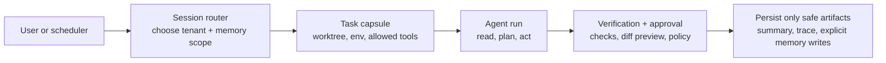

# Session Isolation Patterns for Long-Lived AI Agents

Long-lived agents fail in a very specific way. The first task goes fine, the second inherits too much context, and by the third run you are debugging stale memory, dirty filesystem state, and tool permissions that no longer match the job in front of you.

That drift is not just annoying. It turns small mistakes into cross-task contamination. An agent that should be editing one repo starts referencing another ticket, another branch, or another user's data because the session boundary was never real in the first place.

If you want agents to stay useful for hours or days, you need isolation that is stronger than “start a new chat when it feels weird.” This is the pattern I would use: session-scoped memory, per-task worktrees, narrow tool lanes, and explicit approval resets.

## Why this matters

A long-lived agent is really several state machines pretending to be one worker:

- conversational state
- repo or filesystem state
- tool credentials and write permissions
- queued tasks and retries
- user-specific memory or notes

If those states share the same bucket, you get the classic failures people blame on “model unreliability” even when the architecture caused them.

Useful references: [OpenAI Agents SDK](https://openai.github.io/openai-agents-python/), [OpenTelemetry](https://opentelemetry.io/), [git worktree](https://git-scm.com/docs/git-worktree), and [Model Context Protocol](https://modelcontextprotocol.io/introduction).

## Architecture or workflow overview

I like a four-layer isolation model: conversation state, task workspace, tool lane, and approval gate.



### Isolation boundaries I actually care about

1. **Session memory boundary** so one user's notes do not bleed into another task.
2. **Workspace boundary** so each task gets its own branch or worktree.
3. **Tool boundary** so read tools, write tools, and external actions are separated.
4. **Approval boundary** so permission granted for one action is not silently reused later.

## Implementation details

### 1. Keep memory scoped and typed

I do not want a single blob of “agent memory.” I want separate stores for working context, explicit durable facts, and task-local scratch data.

```yaml
session_id: sess_01HV7M
user_scope: anirudh
memory:
  working_set_ttl_minutes: 90
  durable_fact_store: memory/profile.json
  task_scratchpad: runs/sess_01HV7M/task_42/scratch.md
write_policy:
  durable_requires_explicit_signal: true
  redact_secrets_before_persist: true
  max_summary_tokens: 400
```

That split matters because most long-lived failures come from writing too much too early. Durable memory should be slow, opinionated, and reviewable. Scratch state should be cheap to throw away.

### 2. Give every task its own filesystem capsule

A clean worktree is one of the best isolation wins per minute. It makes cleanup easy, keeps diffs scoped, and gives retries a deterministic base.

```bash
git worktree add ../tasks/task-42 origin/master
cd ../tasks/task-42
python -m venv .venv
source .venv/bin/activate
pytest -q
```

If the task fails badly, you can delete the entire capsule instead of trying to “repair” a polluted directory. I would avoid shared mutable repos for long-lived agent workers unless the task is strictly read-only.

### 3. Route tools through capability lanes

The agent should not see every tool as equally available. I prefer capability lanes that can be attached to a run.

```python
from dataclasses import dataclass

@dataclass
class ToolLane:
    name: str
    read_tools: list[str]
    write_tools: list[str]
    external_tools: list[str]
    approval_required: bool

repo_fix_lane = ToolLane(
    name='repo-fix',
    read_tools=['read_file', 'search_code', 'git_diff'],
    write_tools=['edit_file', 'git_commit'],
    external_tools=['gh_pr_create'],
    approval_required=True,
)
```

This structure does two useful things. First, it stops accidental tool escalation. Second, it makes auditing simple because every run can be tagged with the lane it used.

### 4. Persist only safe outputs after verification

I want post-run persistence to be selective. Save the summary, diff stats, trace metadata, and approved durable notes. Do not blindly roll the entire conversation forward.

```json
{
  "task_id": "task-42",
  "session_id": "sess_01HV7M",
  "result": "needs_review",
  "artifacts": {
    "diff": "artifacts/task-42.patch",
    "checks": "artifacts/checks.json",
    "trace": "artifacts/trace.json"
  },
  "persist": {
    "working_summary": true,
    "durable_memory": false,
    "approval_token_reusable": false
  }
}
```

That last field is important. I would not let approval tokens survive across materially different actions.

```text
$ run-agent --session sess_01HV7M --task fix-login-timeout
[router] scope=user:anirudh lane=repo-fix
[capsule] worktree=../tasks/task-42 base=origin/master
[agent] touched files: api/auth.py, tests/test_auth.py
[verify] pytest tests/test_auth.py -q ................ PASS
[verify] policy check: external write requested ...... HOLD
[persist] summary saved, durable memory skipped, approval reset
```

## What went wrong and the tradeoffs

### Failure mode 1, the memory layer becomes a junk drawer

If every summary gets promoted to durable memory, the agent starts retrieving stale preferences, outdated repo state, or task-specific hacks as if they were truths.

**What I would not do:** auto-save every important-looking sentence. Make durable writes explicit and sparse.

### Failure mode 2, shared workspaces create ghost bugs

When several tasks share one checkout, you can get impossible-to-explain behavior: leftover generated files, mismatched dependencies, or edits from a prior task that look like the model hallucinated them. It is usually not hallucination. It is contamination.

### Failure mode 3, approval scope quietly expands

This one worries me the most. A user approves one push or one external API call, then the agent assumes it can keep doing adjacent actions. Approval needs a fingerprint tied to the exact command, artifact, or target.

<div class="callout callout-warning"><strong>Pitfall:</strong> “same session” is not a security boundary. If the task changed, the approval and tool scope should usually change too.</div>

### Tradeoff table

| Pattern | Operational cost | Reliability gain | Main downside |
| --- | --- | --- | --- |
| Shared session + shared repo | Low | Low | drift compounds fast |
| Fresh chat only | Low | Medium | filesystem and tool state still leak |
| Per-task worktree + scoped memory | Medium | High | more setup and cleanup |
| Full container or microVM per task | High | Very high | slower and heavier for local workflows |

My bias is to start with scoped memory plus per-task worktrees, then add stronger runtime isolation only where the repo or data sensitivity justifies it.

## Practical checklist

<div class="callout callout-success"><strong>Best practice:</strong> make the cleanup path a first-class feature. If a task capsule cannot be reset in seconds, it will eventually poison the next run.</div>

- separate working memory, durable memory, and throwaway scratch state
- create a fresh worktree or sandbox per write-capable task
- tag each run with a capability lane instead of exposing every tool
- expire approvals after the exact approved action
- persist summaries and artifacts, not entire raw contexts by default
- trace task id, session id, tool lane, and changed files for debugging
- add a one-command teardown path for failed runs

## Conclusion

Long-lived agents are not unreliable because they stay alive too long. They become unreliable when we let memory, files, tools, and approvals share one fuzzy boundary. Tighten those boundaries and the same model suddenly looks a lot more production-ready.
