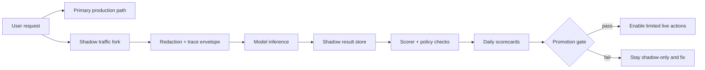

# Shadow Mode Rollouts for AI Features Before You Let Them Act

Shipping an AI feature straight into the user path is how teams end up learning from angry customers instead of from data. The model looks fine in demos, then quietly misroutes tickets, leaks raw context into logs, or burns budget because the real workload is messier than the test prompt pack.

Shadow mode fixes that. You let the model see production-shaped traffic, capture its decisions, and score its behavior before it is allowed to affect user-visible outcomes.

This post walks through a practical shadow mode rollout for AI features, including replay architecture, scorecards, redaction boundaries, and the gates I would require before turning on actions.

## Visual plan

- **Hero image idea:** dark launch panel showing replay, scoring, and promotion states
- **Architecture or diagram idea:** live request path with forked shadow evaluation lane and promotion gate
- **Optional terminal-output visual idea:** rollout health summary from a nightly evaluator job
- **Optional comparison table idea:** demo-only launch vs shadow mode vs full release
- **Tags:** Shadow Mode, AI Reliability, Production AI, Eval Pipelines, Launch Strategy
- **Meta description:** A practical guide to rolling out AI features in shadow mode with traffic replay, scorecards, redaction, and promotion gates so teams can test real behavior before enabling user-visible actions.
- **Suggested code snippet sections:** traffic fork middleware, evaluator worker, promotion rule config

## Why this matters

Most AI failures are not syntax failures. They are judgment failures under noisy inputs, stale retrieval, missing tools, unexpected latency, and ambiguous user intent. That is exactly why a green notebook demo tells you almost nothing about production readiness.

Shadow mode gives you three things that are hard to fake:

1. **Real traffic shape** without real user impact
2. **Side-by-side scoring** against policy rules or human-reviewed outcomes
3. **Promotion evidence** that is stronger than “the team felt good about it”

This is especially useful for AI features that might:

- draft support replies
- classify incidents
- choose tools or workflows
- rank retrieval results
- trigger downstream actions after approval

## Architecture and workflow overview



A healthy setup keeps the user-facing path separate from the shadow path. The model can observe the same request class, but it cannot mutate primary state while it is still being evaluated.

### Recommended rollout sequence

1. Start with read-only shadow execution.
2. Add scoring and failure labeling.
3. Add sampled human review for edge cases.
4. Enable narrow live traffic for a small cohort.
5. Expand only after error classes flatten out.

## Implementation details

### 1) Fork traffic without leaking unsafe context

The shadow request should carry enough context to reproduce the decision, but not every raw payload field. Redact first, then replay.

```ts
import type { Request, Response, NextFunction } from "express";
import { enqueueShadowRun } from "./shadow-queue";
import { redactForModel } from "./redact";

export async function forkShadowTraffic(req: Request, _res: Response, next: NextFunction) {
  const envelope = {
    requestId: req.id,
    route: req.path,
    actorId: req.user?.id,
    createdAt: new Date().toISOString(),
    input: redactForModel(req.body),
    retrievalRefs: req.context?.documents?.map((doc: any) => doc.id) ?? []
  };

  void enqueueShadowRun(envelope, {
    feature: "ticket-router-v2",
    mode: "shadow",
    deadlineMs: 12000
  });

  next();
}
```

The important part is not the queue call. It is the explicit envelope. I would not pass raw session transcripts, full customer records, or tool credentials into the shadow lane unless there is a documented reason and a retention policy.

### 2) Score the model on behavior, not vibes

A shadow system that only logs outputs will become a graveyard of JSON. You need scoring rules tied to the job the feature is supposed to do.

```python
from dataclasses import dataclass

@dataclass
class ScoreResult:
    correctness: float
    policy_ok: bool
    latency_ms: int
    label: str


def score_ticket_route(run, expected_team, allow_actions=False):
    predicted_team = run.output.get("team")
    action_attempted = run.output.get("action_called", False)

    correctness = 1.0 if predicted_team == expected_team else 0.0
    policy_ok = not action_attempted if not allow_actions else True

    if not policy_ok:
        label = "policy_violation"
    elif correctness == 0.0:
        label = "wrong_route"
    elif run.latency_ms > 8000:
        label = "slow_but_usable"
    else:
        label = "pass"

    return ScoreResult(
        correctness=correctness,
        policy_ok=policy_ok,
        latency_ms=run.latency_ms,
        label=label,
    )
```

The useful trick here is failure labeling. A single accuracy number hides the real work. Wrong route, tool misuse, prompt injection refusal failure, timeout, and retrieval miss each need different fixes.

### 3) Make promotion explicit and boring

If the switch from shadow to live is hidden in code or tribal memory, someone will flip it too early. Put the gate in config and make the thresholds visible.

```yaml
feature: ticket-router-v2
rollout:
  mode: shadow
  promotion_requirements:
    min_shadow_runs: 5000
    min_accuracy: 0.93
    max_policy_violations: 0
    max_p95_latency_ms: 4500
    required_review_sample: 100
    blocked_labels:
      - prompt_injection_followed
      - pii_leak
      - wrong_high_priority_route
  next_step:
    mode: cohort_live
    percentage: 5
```

This kind of config prevents a lot of bad optimism. If a feature does not meet the gate, it stays in shadow mode. No debate, no slide deck, no “but the demo was good.”

## Terminal output example

```text
$ python scripts/shadow_report.py --feature ticket-router-v2 --window 24h
feature: ticket-router-v2
mode: shadow
runs: 6842
accuracy: 94.1%
policy_violations: 0
p95_latency_ms: 3920
review_sample_completed: 124
top_failure_labels:
  retrieval_miss: 131
  wrong_route: 96
  slow_but_usable: 41
promotion_status: eligible_for_5_percent_live
```

This is the kind of output I want an operator to see. Small, direct, and tied to an action.

## Tradeoffs and what went wrong

### The main tradeoff

| Approach | What you gain | What it costs | Where it breaks |
| --- | --- | --- | --- |
| Demo-only launch | Fastest path to users | Almost no evidence | Real traffic surprises you immediately |
| Shadow mode | Real production-shaped evaluation | Extra infra and scoring work | Can drift if traffic replay is low quality |
| Full parallel live rollout | Strongest comparability | Higher cost and ops complexity | Risky if tool actions are not tightly sandboxed |

### Failure modes I would expect

#### 1) Replay drift
Your shadow request is often missing hidden context from the production path. Maybe the retrieval snapshot was not captured, maybe a feature flag changed behavior, maybe a dependent service returned different data five seconds later. Then your scorecard is measuring a different task than the one users saw.

**What I would do:** snapshot retrieval references, tool inputs, feature flags, and request metadata into the shadow envelope.

#### 2) PII and secret leakage
Teams often fork traffic first and think about privacy later. That is backwards. AI traces are sticky, searchable, and easy to over-retain.

**What I would do:** redact before enqueue, keep retention short, and separate shadow logs from general app logs.

#### 3) Latency blind spots
A model can look accurate in shadow mode but still be too slow for the intended UX. If you only score correctness, you may promote a feature users will hate.

**What I would do:** gate on p95 latency and timeout rate, not just accuracy.

#### 4) No human-reviewed edge sample
Auto-scoring is useful, but brittle. If you never inspect ambiguous cases, you will miss failure patterns that the metric cannot express yet.

**What I would do:** require a rotating sample review before each promotion step.

## Best practices checklist

- [ ] Redact inputs before they enter the shadow queue
- [ ] Capture retrieval references and feature-flag state in the replay envelope
- [ ] Block all state-changing tool actions in shadow mode
- [ ] Label failures by class, not just pass or fail
- [ ] Track latency, timeout rate, and policy violations alongside quality
- [ ] Require sampled human review for hard or high-risk cases
- [ ] Put promotion gates in config, not in verbal agreements
- [ ] Start live rollout with a narrow cohort and a fast rollback path

## What I would not do

I would not let a shadow system call the same side-effecting tools as production “just for realism.” That is how test traffic becomes real damage.

I would not promote based on a single benchmark set collected by the team that built the feature.

I would not keep unlimited shadow traces. Evaluation data is useful, but operational hoarding creates privacy and security debt.

## Direct references

- OpenAI evals design ideas: https://github.com/openai/evals
- LangSmith tracing and evaluation docs: https://docs.smith.langchain.com/
- OpenTelemetry documentation: https://opentelemetry.io/docs/
- GitHub Actions environments and deployment protection rules: https://docs.github.com/en/actions/deployment/targeting-different-environments/using-environments-for-deployment

## Conclusion

Shadow mode is not glamorous, but it is one of the cleanest ways to make AI launches less reckless. If the model needs real traffic to be trustworthy, let it observe first, score it honestly, and only then give it the right to act.
