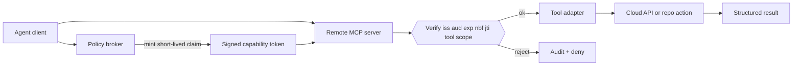

# Signed Tool Claims for Remote MCP Servers Without Ambient Access

Remote MCP servers get risky the moment they stop being local toys. The happy path looks clean: an agent asks for a tool, the server runs it, and the result comes back. The ugly path is what happens after that server picks up write access, cloud credentials, or repo mutation rights.

Too many setups still rely on ambient trust. If the client is connected, it can ask for anything. If a token leaks, it usually leaks broad access. That is fine for a demo and terrible for production.

The safer pattern is to treat each high-value tool call like a scoped capability. Mint a short-lived signed claim for the exact tool, exact audience, and exact action envelope, then make the MCP server verify it before anything dangerous runs.

## Why this matters

Remote MCP is becoming the default shape for shared tool servers, hosted gateways, and multi-user agent systems. Once the server lives outside the editor process, you need a real answer for four problems:

- who is allowed to call the tool
- what scope they actually have
- how long that permission lasts
- how to stop a captured request from being replayed

If you skip that layer, you usually end up with one of two bad designs. Either the MCP server holds broad permanent credentials and trusts the caller too much, or the client holds broad permanent credentials and shoves them through the tool layer.

Useful references here: [Model Context Protocol](https://modelcontextprotocol.io/), [JWT](https://datatracker.ietf.org/doc/html/rfc7519), [OAuth 2.0 Token Exchange](https://datatracker.ietf.org/doc/html/rfc8693), and [RFC 8725 JWT Best Current Practices](https://datatracker.ietf.org/doc/html/rfc8725).

> **Best-practice callout**  
> Treat every remote tool invocation as a capability grant with a TTL, not as proof that the connection once authenticated successfully.

## Architecture or workflow overview

### Mermaid flow



### Decision sequence

1. Authenticate the user or agent session once.
2. Ask a policy broker to mint a claim for one tool and one action envelope.
3. Bind that claim to the MCP server audience and a very short TTL.
4. Make the server verify signature, audience, expiry, not-before time, and replay ID.
5. Only then hand the request to the actual tool adapter.

## Implementation details

### Claim shape I would actually use

Keep the token boring. You want explicit fields, narrow scope, and enough metadata to audit what happened later.

```json
{
  "iss": "https://broker.example.com",
  "sub": "session:discord:8451",
  "aud": "mcp://repo-admin-server",
  "exp": 1780001220,
  "nbf": 1780001160,
  "jti": "4d7249b3-f1a1-4d83-88f5-bf25f9934c38",
  "tool": "github.create_pull_request",
  "scope": ["repo:write", "pr:create"],
  "args_hash": "sha256:54f2e5...",
  "risk": "high",
  "approval_id": "appr_01hxz..."
}
```

The important part is `args_hash`. Without it, the client can mint a claim for one PR and try to reuse it for a different payload. Hash the normalized request body and verify it server-side before execution.

### Verification middleware on the MCP server

The MCP server should fail closed before the tool adapter sees anything.

```ts
import { createRemoteJWKSet, jwtVerify } from "jose";
import { sha256 } from "./hash.js";
import { replayCache } from "./replay-cache.js";

const jwks = createRemoteJWKSet(new URL("https://broker.example.com/.well-known/jwks.json"));

export async function authorizeToolCall(token: string, toolName: string, args: unknown) {
  const { payload } = await jwtVerify(token, jwks, {
    issuer: "https://broker.example.com",
    audience: "mcp://repo-admin-server",
    algorithms: ["ES256"]
  });

  if (payload.tool !== toolName) throw new Error("tool mismatch");
  if (payload.args_hash !== `sha256:${sha256(JSON.stringify(args))}`) {
    throw new Error("argument envelope mismatch");
  }
  if (await replayCache.has(payload.jti as string)) throw new Error("replayed token");

  await replayCache.put(payload.jti as string, Number(payload.exp));
  return payload;
}
```

This is where a lot of systems get lazy. They verify the signature and stop there. That is not enough. A valid token with the wrong audience, wrong tool name, or reused replay ID should die immediately.

### Broker policy that maps task risk to claim TTL

The broker is where you decide how much power a session can temporarily borrow.

```yaml
policies:
  - match:
      tool: github.create_pull_request
      actor_type: agent
    issue:
      ttl_seconds: 180
      risk: medium
      scopes: [repo:write, pr:create]
      require_approval: true
  - match:
      tool: aws.apply_terraform
      actor_type: agent
    issue:
      ttl_seconds: 60
      risk: high
      scopes: [cloud:deploy]
      require_approval: true
      require_args_hash: true
      require_human_window: true
```

I like this split because it keeps identity separate from action authority. The user or agent authenticates once, but every dangerous tool call still needs a fresh capability decision.

### Terminal-output visual

```text
$ broker issue-claim --tool github.create_pull_request --ttl 180 --bind-args pr.json
claim_id: clm_01j7r7h7w0q4
risk: medium
audience: mcp://repo-admin-server
expires_in: 180s
args_hash: sha256:54f2e5b4...

$ mcp-server run github.create_pull_request --claim ./claim.jwt --args ./pr.json
authorize: ok
replay_check: ok
tool: github.create_pull_request
result: pr_url=https://github.com/acme/api/pull/412
```

### Comparison table

| Pattern | What it feels like | Why people use it | Why I do not trust it |
| --- | --- | --- | --- |
| Ambient API key on the server | Simple | Fast to wire up | Any compromised caller inherits broad power |
| Long-lived user token passed through the client | Flexible | Easy to prototype | Hard to scope, rotate, and audit per action |
| Signed short-lived tool claim | Slightly more work | Precise, auditable, revocable | Requires broker, clock discipline, and replay storage |
| Mutual TLS only | Strong transport identity | Good for service-to-service auth | Still does not scope one tool call from another |

## What went wrong, and the tradeoffs

### Failure mode 1: replay protection gets skipped

If the token is valid for two minutes and you do not store `jti`, an attacker does not need to forge anything. They only need to replay a captured request inside the TTL window.

### Failure mode 2: the claim is broad but the signature is perfect

A beautifully signed token is still dangerous if it says `scope: ["*"]` or omits the tool name. Signature quality is not permission quality.

### Failure mode 3: clocks drift and everything starts failing randomly

Short TTLs are good. Bad NTP is not. If your broker and MCP server disagree on time by even 30 to 60 seconds, the denies start looking flaky and people will pressure you to widen the window too far.

### Security and ops tradeoffs

| Concern | Better for security | Better for convenience | My recommendation |
| --- | --- | --- | --- |
| TTL length | 30 to 180 seconds | 15 minutes or more | Keep it short and re-issue cheaply |
| Scope granularity | one tool and one action | shared token across many tools | one claim per risky tool call |
| Replay store | durable distributed cache | none | at least a bounded TTL cache |
| Args binding | hash the normalized payload | trust the client payload | always bind high-risk writes |
| Approval state | explicit approval ID in claim | implicit trust from login | carry approval evidence in the token |

> **Pitfalls section**
> - Do not use `alg=none` or trust the token header blindly.
> - Do not let the client choose the audience string freely.
> - Do not skip argument binding for write tools.
> - Do not share one claim across a batch of unrelated dangerous operations.
> - Do not keep replay IDs forever, but absolutely keep them for the token lifetime.

## Practical checklist

### What I would do again

- Put a policy broker in front of every remote high-risk MCP tool.
- Use ES256 or another modern asymmetric signature, plus a JWKS endpoint.
- Bind the claim to one audience, one tool, and one normalized argument envelope.
- Store `jti` long enough to block replay within the TTL window.
- Log claim ID, approval ID, subject, tool name, and result status together.

### What I would not do

- I would not let a remote MCP connection imply standing write access.
- I would not forward raw cloud keys through the agent tool layer.
- I would not issue ten-minute claims just because clocks are messy.
- I would not mix authentication and per-tool authorization into one vague session flag.

## Conclusion

Remote MCP gets much safer when tool authority becomes explicit, short-lived, and verifiable. The broker mints the claim, the server checks every field, and the tool runs only if the exact envelope matches what was approved.

That sounds stricter because it is. It is also the difference between a useful remote tool platform and a polite wrapper around ambient privilege.
