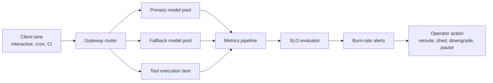

# SLOs and Burn-Rate Alerts for AI Coding Gateways Before Slow Turns Become Failed Runs

AI coding gateways rarely fail in one dramatic step. More often, they get strange first. First token latency doubles, tool calls start timing out, fallback traffic spikes, and developers report that the agent feels off before anything is fully down.

That gray area is where a lot of teams lose trust. If the gateway serves repo automation, terminal coding sessions, and scheduled jobs, “a little slower than usual” can easily become half-finished patches, missed cron windows, and people retrying runs that were already in trouble.

This post walks through a practical SLO model for AI coding gateways: what to measure, how to split budgets by lane, and how to alert on burn rate before developers experience reliability drift as random workflow pain.

## Why this matters

Coding gateways are not just chat endpoints. They sit in front of model pools, tool routers, fallback policy, prompt caches, and approval-sensitive automation. That means classic uptime is not enough.

A gateway can be technically up while still being functionally bad at its job. If interactive sessions take 18 seconds to first token, or patch-verification runs fall back to a cheaper lane with worse tool reliability, your system is serving requests but failing users.

That is why I prefer SLOs that track the shape of useful work, not just request success. For coding workflows, the key questions are:

- Did the model start responding fast enough to keep the loop usable?
- Did the gateway finish the run within the lane's expected deadline?
- Did tool-heavy requests stay inside their error budget without excessive fallback?
- Did degraded behavior surface early enough for operators to steer traffic?

## Architecture or workflow overview



The useful pattern is to evaluate separate reliability lanes instead of one blended average:

1. **Interactive coding lane** tracks first-token latency and turn completion.
2. **Scheduled automation lane** tracks end-to-end success before deadline.
3. **Tool-heavy lane** tracks tool success ratio and fallback frequency.
4. **Safety lane** tracks approval failures separately so policy denials do not hide real outages.

## Implementation details

### 1) Define SLOs around user-visible work

I would not start with raw request success. For coding systems, the better units are first-token latency, turn completion latency, and workflow success before deadline.

```yaml
slos:
  interactive_first_token:
    objective: 0.95
    window: 30d
    sli: first_token_latency_ms <= 2500
    filters:
      lane: interactive
  scheduled_run_deadline:
    objective: 0.99
    window: 30d
    sli: run_completed_before_deadline == true
    filters:
      lane: scheduled
  tool_step_success:
    objective: 0.985
    window: 30d
    sli: tool_step_success == true
    filters:
      lane: tool_heavy
```

These SLOs are intentionally concrete. A developer can feel the difference between 2.5 seconds and 9 seconds to first token. A cron job either hit its deadline or it did not. That makes the budgets easier to defend.

### 2) Emit lane-aware metrics from the gateway itself

The gateway should label every request with enough context to explain drift later. I usually want lane, model pool, fallback status, tool count, cache hit state, and whether the run finished or was operator-aborted.

```ts
metrics.observe('gateway_first_token_ms', firstTokenMs, {
  lane: request.lane,
  model_pool: response.pool,
  fallback: String(response.usedFallback),
  cache_prefix_hit: String(response.cachePrefixHit),
  tool_count_bucket: bucketize(request.toolCalls.length)
});

metrics.increment('gateway_run_outcome_total', 1, {
  lane: request.lane,
  outcome: run.completedBeforeDeadline ? 'success' : 'deadline_miss',
  model_pool: response.pool
});
```

Without these labels, burn alerts tell you something is wrong but not whether the issue is a single overloaded model pool, a cache miss storm, or one tool adapter poisoning the whole workflow.

### 3) Burn-rate alerts should reflect how fast you are spending trust

A lot of teams alert on absolute error rate only. That is too slow for agent infrastructure. If your interactive lane burns through a week's budget in 45 minutes, you want to know immediately.

```promql
# Fast-burn alert for first-token SLO
(
  1 - (
    sum(rate(gateway_first_token_sli_good_total{lane="interactive"}[5m])) /
    sum(rate(gateway_first_token_sli_total{lane="interactive"}[5m]))
  )
) > (1 - 0.95) * 14.4
```

The exact multiplier depends on your paging philosophy, but the idea is stable: alert on budget consumption speed, not just current pain. Fast-burn catches sharp incidents. Slower-burn alerts catch the “service feels weird today” degradation that often matters more for coding loops.

```promql
# Slow-burn alert for scheduled automation lane
(
  1 - (
    sum(rate(gateway_run_deadline_good_total{lane="scheduled"}[1h])) /
    sum(rate(gateway_run_deadline_total{lane="scheduled"}[1h]))
  )
) > (1 - 0.99) * 3
```

### 4) Tie alerts to concrete fallback actions

Burn alerts are only useful if they drive a predictable operator response. I like a small action table tied to each lane.

| Alert condition | Likely cause | Operator action |
| --- | --- | --- |
| Interactive fast-burn on first-token latency | overloaded primary pool, cache miss storm | reroute small requests, trim long-context lane, shed non-urgent traffic |
| Scheduled deadline misses rising | tool queue saturation or slow model tier | pause low-priority cron runs, extend deadlines for non-critical jobs, shift to secondary region |
| Tool-step SLO burn | flaky MCP adapter or shell runner | isolate broken tool lane, disable tool class, preserve chat-only traffic |
| Fallback rate spike with normal request volume | primary pool instability | drain unhealthy pool, lock safe fallback, review quality regression risk |

This is the difference between observability and operations. Metrics tell you what changed. Action tables decide what happens next.

## What went wrong and tradeoffs

One common mistake is blending all requests into a single availability number. That hides the real problem. A gateway can look healthy because cheap chat requests are fine while long coding turns are quietly degrading.

Another failure mode is alerting on model errors while ignoring fallback overuse. A fallback that keeps requests technically successful can still be a bad user experience if it is slower, worse at tool use, or more expensive than the normal lane.

> **Pitfall:** do not count policy denials as gateway failures. Approval rejections, tool allowlist blocks, and scope denials are real events, but they belong in a separate safety dashboard. Mixing them into uptime metrics makes outages and guardrails harder to distinguish.

There is also a cost tradeoff. More granular SLOs mean more labels, more dashboards, and more arguments about which lane deserves premium capacity. I still think that is better than pretending one average latency number captures AI coding reliability.

What I would not do is page on every model hiccup. Page on burned user trust instead. If a brief blip stays inside the budget and the fallback lane masked it cleanly, a dashboard note is enough.

## Practical checklist

- Define separate SLOs for interactive, scheduled, and tool-heavy lanes.
- Measure first-token latency, run deadline success, and fallback rate.
- Label metrics with lane, pool, fallback status, and tool-count bucket.
- Use fast-burn and slow-burn alerts instead of one static threshold.
- Keep policy denials separate from reliability failures.
- Attach every alert to an operator playbook action.
- Review whether fallback preserved quality, not just availability.

## Conclusion

AI coding gateways need the same discipline as other production systems, but the useful signals are slightly different. Developers notice responsiveness, deadline misses, and degraded tool behavior long before a generic uptime graph looks scary.

If you measure the right things and alert on error-budget burn instead of vague averages, you can catch reliability drift early, protect good workflows, and keep one slow model pool from turning into a trust problem across the whole gateway.
