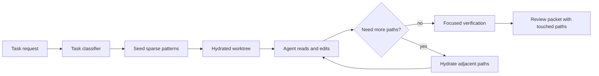

# Sparse Checkout Workflows for AI Coding Agents in Large Monorepos

Most AI coding demos assume the model can see a whole repository, but real monorepos punish that assumption fast. The repo is too large to hydrate casually, the working tree gets noisy, and the agent spends half its budget reading directories that have nothing to do with the bug.

That does not just waste tokens. It creates false confidence. The agent sees a partial mess, guesses how the system hangs together, and edits the closest-looking package instead of the right one.

What works better is a sparse-checkout workflow with explicit hydration rules, repo-map hints, and verifier lanes that can expand only when the task proves it needs more surface area. This is the setup I would use for AI coding agents in a large JavaScript, Go, or polyglot monorepo.

## Why this matters

Sparse checkout is not about saving a few seconds on clone time. It changes the quality envelope for AI-assisted edits in big repos:

- the agent reads fewer irrelevant files, so context quality improves
- search results get tighter because half the repo is not competing for attention
- focused verification is easier to define when the task footprint is explicit
- reviewers can tell whether the agent wandered outside its lane

If your monorepo has dozens of apps, shared packages, infra folders, and generated code, selective hydration is often a better guardrail than writing ever-longer prompt instructions.

## Architecture or workflow overview



The workflow has four pieces:

1. **Seed patterns** for the minimum directories a task probably needs.
2. **Hydration rules** for when the agent can expand that footprint.
3. **Verification lanes** that stay scoped to the hydrated surface first.
4. **Touched-path reporting** so humans can see whether the agent stayed disciplined.

## Implementation details

### 1) Start every task with cone-mode sparse checkout

Cone mode is the practical default because it is fast and understandable. The goal is not perfect minimalism. The goal is a small, sane working tree that matches the task.

```bash
git sparse-checkout init --cone
git sparse-checkout set   apps/payments-web   packages/ui-kit   packages/auth-client   tooling/eslint-config
```

For an AI coding agent, this is better than cloning the entire repo and hoping retrieval will compensate. The file system itself becomes a guardrail.

### 2) Encode seed patterns in task metadata

Do not make the agent infer sparse patterns from scratch every time. Give it a starting map, then let it expand deliberately.

```yaml
# task-manifest.yaml
task: fix-checkout-button-loading-state
repoLane: web-frontend
seedPaths:
  - apps/payments-web
  - packages/ui-kit
  - packages/auth-client
adjacentHydration:
  - packages/feature-flags
  - packages/telemetry
verify:
  - pnpm --filter payments-web test loading-button
  - pnpm --filter payments-web lint
maxHydrationSteps: 2
```

That manifest does three useful things:

- it gives the agent a plausible starting slice
- it names safe adjacent directories if imports lead outward
- it limits expansion so one ambiguous error does not turn into full-repo drift

### 3) Hydrate on evidence, not curiosity

The biggest sparse-checkout failure mode is the agent expanding the tree too early. Hydration should happen only after evidence, usually an import edge, build failure, or ownership hint.

```python
from pathlib import Path


def should_hydrate(missing_path: str, allowed_prefixes: list[str], touched_files: list[str]) -> bool:
    path = Path(missing_path)
    if any(str(path).startswith(prefix) for prefix in allowed_prefixes):
        return True
    if any(file.startswith('apps/payments-web/') for file in touched_files) and 'packages/' in str(path):
        return True
    return False
```

That is intentionally boring. You want simple rules that reviewers can understand, not clever expansion logic that silently drags in half the monorepo.

### Example terminal view

```text
$ git sparse-checkout list
apps/payments-web
packages/ui-kit
packages/auth-client
tooling/eslint-config

$ rg "useCheckoutSession" .
apps/payments-web/src/routes/checkout.tsx
packages/auth-client/src/session.ts

$ git sparse-checkout add packages/telemetry
Hydrated 148 files in 0.7s
```

### 4) Keep verification focused before escalating

Sparse checkout helps only if verification stays aligned with the hydrated footprint first.

| Verification lane | When to use it | Why it helps | Risk |
| --- | --- | --- | --- |
| Package-local tests | First pass after edit | Fast signal, cheap reruns | Can miss cross-package drift |
| App-scope build | When imports moved across boundaries | Catches broken integration early | Slower, noisier |
| Repo-wide verification | Only after meaningful surface expansion | Final confidence check | Expensive and often unnecessary |

My rule is simple: run the narrowest verifier that can falsify the change. If the agent had to hydrate three extra packages, then the verification lane should widen too. Not before.

## What went wrong and tradeoffs

<div class="callout"><strong>Pitfall:</strong> sparse checkout can hide generated code, config roots, or shared schemas that matter at runtime. If the agent never hydrates those dependencies, it may produce a patch that looks locally correct but fails once the full repo build runs.</div>

<div class="callout"><strong>Pitfall:</strong> some teams overfit seed patterns to historical bugs. That makes the workflow brittle when ownership changes or imports are reorganized.</div>

There is also a social tradeoff. Sparse checkout forces teams to be more explicit about architecture boundaries. I think that is healthy, but it can reveal that nobody actually knows which package owns a behavior.

### What I would not do

I would not let the agent automatically call `git sparse-checkout disable` after one missing import. That is the monorepo equivalent of giving up. If the task repeatedly needs full-repo visibility, either the classifier is weak or the repo boundaries are not real enough to support focused automation.

### Security and reliability concern

Sparse checkout is not a security boundary. Hidden paths are still in the Git history and can still become visible if the workflow expands carelessly. Treat sparse patterns as operational focus, not data protection.

## Practical checklist

- [ ] Use cone mode unless you have a strong reason not to
- [ ] Store seed paths in task metadata, not only in prompt text
- [ ] Define allowed adjacent hydration paths up front
- [ ] Require evidence before expanding the tree
- [ ] Run package-local verification before repo-wide checks
- [ ] Capture the final hydrated path list in the review summary
- [ ] Audit tasks that keep breaking out into near-full repo hydration

## What I would do again

If I were rolling this out for a team, I would combine three things:

- sparse checkout manifests per workflow lane
- a tiny repo map that links apps to shared packages
- verifier commands that escalate only when hydration expands

That gives you a workflow that is faster, cheaper, and easier to review than pretending every coding task deserves the whole monorepo.

## Conclusion

Large monorepos punish vague agent context. Sparse checkout gives you a better default: start narrow, hydrate on evidence, and verify in layers. Once you treat the working tree itself as part of the control plane, AI coding agents stop wandering nearly as much.

## References

- [Git sparse-checkout documentation](https://git-scm.com/docs/git-sparse-checkout)
- [Git worktree documentation](https://git-scm.com/docs/git-worktree)
- [Git sparse index notes](https://github.blog/open-source/git/make-your-monorepo-feel-small-with-gits-sparse-index/)
