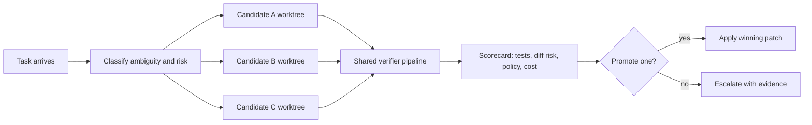

# Speculative Patch Generation for AI Coding Agents That Stays Reviewable

## Hook
When an AI coding agent gets stuck on a tricky bug, the worst pattern is pretending the first patch is probably fine. It usually is not. One candidate may pass tests but hardcode the wrong assumption, another may be architecturally cleaner but break an edge case, and a third may simply not compile.

Speculative patch generation is the workflow I reach for when the bug has more than one plausible fix. Instead of asking one agent for one answer, I let the system generate several narrow candidate patches in parallel, score them with the same verifier pipeline, and promote exactly one result.

This is not about adding model theater. It is about buying optionality without multiplying reviewer pain.

## Why this matters
The production problem is simple: many engineering tasks are ambiguous at first contact. Retry logic, flaky tests, schema edge cases, race conditions, and performance regressions often have multiple valid directions. If your agent commits too early, humans spend the rest of the review untangling a path the machine should have discarded on its own.

A speculative workflow helps when:

- the failure mode has at least two believable root causes
- the edit surface is medium-sized but bounded
- verification is cheaper than long human review threads
- rollback cost is high enough that you want stronger promotion gates

What I would not do is run speculation on every typo, formatting fix, or tiny refactor. The overhead is real.

## Architecture or workflow overview
The core loop is: classify the task, generate 2 to 4 candidate patches in isolated worktrees, run identical verifiers, score the outputs, and promote one patch or escalate to a human if none are good enough.



A useful rule is to speculate on approach, not on everything. Make the candidates different in one meaningful dimension, such as lock strategy, retry placement, caching behavior, or validation order.

## Implementation details
### 1) Spawn isolated candidates
Use one branch or worktree per candidate so the patches cannot trample each other. Git worktrees are a nice fit because they keep file state isolated while sharing the object store.

```bash
git worktree add ../wt-fix-a -b spec/fix-a
git worktree add ../wt-fix-b -b spec/fix-b
git worktree add ../wt-fix-c -b spec/fix-c
```

Each candidate should get a different prompt contract. If every branch receives the same brief, you are mostly paying for duplicates.

```yaml
candidates:
  - id: fix-a
    strategy: "move retry loop to client boundary"
    constraints: ["no schema changes", "preserve timeout budget"]
  - id: fix-b
    strategy: "keep retry local, add idempotency key"
    constraints: ["no new dependency", "must preserve metrics tags"]
  - id: fix-c
    strategy: "fail fast on duplicate writes"
    constraints: ["optimize for safety over throughput"]
```

### 2) Run the same verifier pipeline on every candidate
This is where most teams either win or cheat. Do not let each candidate invent its own proof of correctness. The verifier contract must be shared.

```json
{
  "pipeline": [
    "npm run lint",
    "npm test -- --runInBand",
    "python tools/check_diff_risk.py",
    "semgrep --config p/default .",
    "python tools/score_patch.py results.json"
  ],
  "promotion_threshold": 0.82,
  "hard_fail": ["security", "migration-risk", "snapshot-drift"]
}
```

A candidate that passes tests but trips a policy gate should still lose. This is especially important when the agent is willing to hide risk behind small diffs.

### 3) Build a deterministic scorecard
If promotion depends on vibes, the whole workflow collapses. I like a weighted score that is simple enough to explain in review.

```python
from dataclasses import dataclass

@dataclass
class CandidateScore:
    tests_passed: bool
    lint_passed: bool
    risk_penalty: float
    diff_size_penalty: float
    latency_penalty: float
    reviewer_bonus: float = 0.0

    def total(self) -> float:
        base = 1.0
        if not self.tests_passed or not self.lint_passed:
            return 0.0
        return max(
            0.0,
            base
            - self.risk_penalty
            - self.diff_size_penalty
            - self.latency_penalty
            + self.reviewer_bonus,
        )
```

The point is not pretending the score is mathematically pure. The point is making the choice inspectable and repeatable.

## Terminal view I actually want
```text
candidate   tests   risk   diff   p95-latency   score   result
fix-a       pass    low    42     +4ms          0.91    promote
fix-b       pass    med    67     +1ms          0.79    hold
fix-c       fail    low    21     -2ms          0.00    reject
```

## What went wrong and the tradeoffs
The first failure mode is correlated bad context. If every candidate sees the same flawed incident summary, you get three wrong answers instead of one. I mitigate that by giving each candidate the same invariant set but slightly different hypotheses.

The second failure mode is verifier blind spots. Speculation works only if the promotion gate catches the bad kind of clever. If your tests miss idempotency regressions or policy checks ignore dangerous config drift, the cleanest-looking patch can still be wrong.

The third tradeoff is cost. Parallel candidate generation uses more tokens, more CI, and more local compute. That is acceptable for ambiguous high-leverage fixes, not for routine maintenance.

### Comparison table
| Approach | Best for | Main upside | Main downside |
| --- | --- | --- | --- |
| Single agent, single patch | Small obvious fixes | Lowest cost and fastest loop | Commits too early on ambiguous bugs |
| Speculative patch generation | Medium ambiguity, bounded blast radius | Better fix quality and stronger promotion confidence | Higher token and verification cost |
| Human-only design first | High-risk architecture or migrations | Strongest judgment and constraint handling | Slowest iteration cycle |

### Pitfalls to avoid
- Do not promote the biggest diff just because it looks comprehensive.
- Do not let candidates modify different test fixtures unless that variance is intentional.
- Do not compare scores generated from different verifier versions.
- Do not keep losing candidates around forever. They become noise and accidental future context.

## Practical checklist or decision framework
Use speculative patch generation when most of these are true:

- [ ] there are at least two plausible fix strategies
- [ ] the task can be isolated to a few files or a narrow subsystem
- [ ] verifier cost is lower than expected human review churn
- [ ] you have hard-fail policy checks for security and migrations
- [ ] the team can explain why the promoted patch won
- [ ] losing candidates will be deleted or archived intentionally

If only one of those boxes is checked, I would skip speculation and run a simpler single-patch flow.

## Best practices I would keep
1. Cap candidates at three unless the task is unusually expensive to debug by hand.
2. Keep one shared verifier version for all candidates.
3. Require a short winner summary that explains why the promoted patch beat the others.
4. Record why the losers lost, because that becomes useful training data for future routing.

## Conclusion
Speculative patch generation is worth it when uncertainty is high and review time is expensive. The trick is not generating more code. The trick is generating controlled alternatives, verifying them identically, and promoting exactly one result with evidence.

## References
- [Git worktree documentation](https://git-scm.com/docs/git-worktree)
- [Semgrep documentation](https://semgrep.dev/docs/)
- [Tree-sitter](https://tree-sitter.github.io/tree-sitter/)
