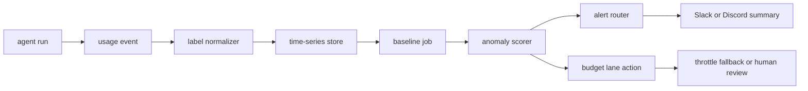

# Token Spend Anomaly Detection for Always-On AI Agents

## Hook

Always-on agents rarely fail with one dramatic invoice. They drift. A new fallback path fires too often, a retrieval loop gets chatty, or a verifier starts replaying large prompts after every timeout. Everything still works, but your daily spend graph starts leaning the wrong way.

The annoying part is that plain provider dashboards usually tell you *that* spend is up, not *which workflow changed shape*. If you run coding agents, cron workers, support automation, or evaluation jobs, you need task-level cost signals before the monthly bill becomes the first alert.

This post walks through a practical token spend anomaly pipeline: label every run, build rolling baselines per lane, fire human-actionable alerts, and avoid the two classic mistakes, alerting on normal product growth and ignoring prompt inflation hidden inside "successful" runs.

## Why this matters

Agent systems create cost in ways that look legitimate at first glance:

- better models quietly become the default
- retries multiply prompt and tool overhead
- retrieval expands context packets over time
- background jobs keep running long after the original need fades

That makes cost a reliability concern, not just a finance report. If a run suddenly needs 4x more input tokens, something operational changed, even if the user-facing result still looks fine.

A useful monitoring design answers four questions quickly:

1. Which workflow lane got more expensive?
2. Is the jump volume-driven or per-run inflation?
3. Did a model route, retry path, or context packet change?
4. What should the operator do next?

## Architecture or workflow overview



The key design choice is to baseline *lanes*, not the whole platform. A nightly eval suite should not share a baseline with customer-facing chat or a repo automation worker.

### Visual plan

- **Hero idea:** dark dashboard-style banner with labeled usage lanes, EWMA baseline, and early alert callout
- **Diagram idea:** run event → labels → baseline → anomaly scorer → alert router → throttle or human review
- **Terminal visual idea:** daily anomaly summary showing lane, delta, probable cause, and next action
- **Comparison table idea:** static budget cap vs anomaly baseline vs hybrid control
- **Tags:** Cost Engineering, AI Agents, Observability, FinOps, Reliability
- **Meta description:** Build token spend anomaly detection for always-on AI agents with labels, rolling baselines, budget lanes, and actionable alerts before quiet cost drift becomes a monthly surprise.
- **Suggested code sections:** usage event schema, rolling baseline scorer, alert summary generation

## Implementation details

Start with one rule: every model invocation must emit a normalized usage event, even if the request fails.

### 1) Emit lane-aware usage events

```json
{
  "ts": "2026-05-23T11:42:18Z",
  "run_id": "run_8fd2",
  "workflow": "repo-pr-worker",
  "lane": "scheduled-medium-risk",
  "model": "gpt-5.4",
  "input_tokens": 18420,
  "output_tokens": 2110,
  "cached_input_tokens": 9400,
  "tool_calls": 6,
  "retry_count": 1,
  "status": "success",
  "git_repo": "negiadventures.github.io",
  "cost_usd": 0.2142
}
```

The `lane` field matters more than most teams expect. If you only group by model, you miss the operational story. The expensive run is usually tied to a workflow pattern, not just a model name.

### 2) Score anomalies against a rolling baseline

I like an EWMA baseline plus median absolute deviation because it is simple, explainable, and good enough for most agent fleets.

```python
from dataclasses import dataclass
from statistics import median

@dataclass
class UsagePoint:
    lane: str
    cost_usd: float
    input_tokens: int
    output_tokens: int


def mad(values: list[float]) -> float:
    center = median(values)
    return median([abs(v - center) for v in values]) or 0.0001


def score_lane(points: list[UsagePoint], current: UsagePoint, alpha: float = 0.25) -> dict:
    costs = [p.cost_usd for p in points]
    ewma = costs[0]
    for value in costs[1:]:
        ewma = alpha * value + (1 - alpha) * ewma

    spread = mad(costs)
    z_like = (current.cost_usd - ewma) / spread
    return {
        "baseline_cost": round(ewma, 4),
        "spread": round(spread, 4),
        "score": round(z_like, 2),
        "is_anomalous": current.cost_usd > ewma * 1.8 and z_like >= 4.0,
    }
```

This is intentionally boring. That is a feature. Operators can reason about it during an incident. Fancy black-box anomaly detectors tend to lose trust fast when they cannot explain why a normal traffic spike got paged.

### 3) Generate alerts with an operator hint

An alert without probable cause is just a guilt delivery system. Include model route, retry count, cache effectiveness, and context size change.

```python
def build_alert(run: dict, baseline: dict) -> str:
    cache_ratio = 0.0
    if run["input_tokens"]:
        cache_ratio = run["cached_input_tokens"] / run["input_tokens"]

    return f"""
Lane: {run['lane']}
Workflow: {run['workflow']}
Cost: ${run['cost_usd']:.4f} vs baseline ${baseline['baseline_cost']:.4f}
Score: {baseline['score']}
Model: {run['model']}
Retries: {run['retry_count']}
Cache hit ratio: {cache_ratio:.0%}
Likely check: route change, retry storm, or larger context packet
Recommended action: inspect last 20 runs and compare token shape before throttling
""".strip()
```

### Example terminal summary

```text
$ agent-cost-watch daily-summary --lane scheduled-medium-risk

lane=scheduled-medium-risk
runs=148
avg_cost=$0.071
current_p95=$0.204
baseline_p95=$0.109
anomalies=3
likely_cause=retry inflation after verifier timeout change
next_action=cap retries at 1 and re-check context packet size
```

## What went wrong / tradeoffs

### The first candidate I would *not* trust: hard daily caps only

Static budget caps are useful, but they are too blunt on their own. They catch catastrophes late and say nothing about why costs shifted. If a lane grows gradually from $0.04 to $0.11 per run, a daily cap can stay green while your unit economics quietly rot.

### Comparison table

| Control style | Good at | Weak at | Best use |
| --- | --- | --- | --- |
| Static daily cap | catching runaway spend | misses gradual drift | final safety net |
| Pure anomaly baseline | spotting shape changes | noisy during launches | operator visibility |
| Hybrid cap + baseline | alerting early and containing blast radius | more moving parts | most production agent systems |

### Failure modes I keep seeing

<div class="callout callout-warning">
  <strong>Pitfalls:</strong>
  <ul>
    <li>Mixing unrelated workflows into one baseline, which hides real anomalies.</li>
    <li>Ignoring failed runs, even though retries and failed tool loops often create the spend spike.</li>
    <li>Alerting on total daily cost instead of per-run inflation, which confuses growth with waste.</li>
    <li>Missing cached-token ratios, so prompt regressions look like model-price changes.</li>
  </ul>
</div>

### Security and reliability concern

Cost alerts can expose private workload names, repo names, or user identifiers if you dump raw labels into chat. Normalize labels up front and redact anything user-derived before sending alerts outside your metrics store.

### What I would not do

I would not let anomaly detection auto-switch every workflow to a cheaper model the moment spend rises. That often turns one problem into two: higher costs and degraded outcomes. Alert first, throttle second, reroute only in clearly defined fallback lanes.

## Practical checklist or decision framework

<div class="callout callout-success">
  <strong>What I would do again:</strong>
  <ul>
    <li>Label every run with workflow and lane before building any dashboards.</li>
    <li>Track per-run cost, retry count, cache ratio, and input token growth together.</li>
    <li>Use a simple explainable baseline before reaching for more complex detection.</li>
    <li>Send alerts with one probable-cause hint and one concrete next step.</li>
    <li>Keep a hard budget ceiling as the final blast-radius guard.</li>
  </ul>
</div>

### Shipping checklist

- [ ] every model call emits a normalized usage event
- [ ] failed runs count toward spend analysis
- [ ] baselines are separated by workflow lane
- [ ] alerts include retry count and cache effectiveness
- [ ] operators can compare the current run against the previous 20 runs
- [ ] a hard spend cap still exists for catastrophic failures

## Conclusion

If you run agents continuously, token spend is an operational signal, not just a billing artifact. The practical win is not a perfect forecast. It is catching quiet per-run inflation early enough that a human can fix the workflow before the invoice becomes the incident report.
