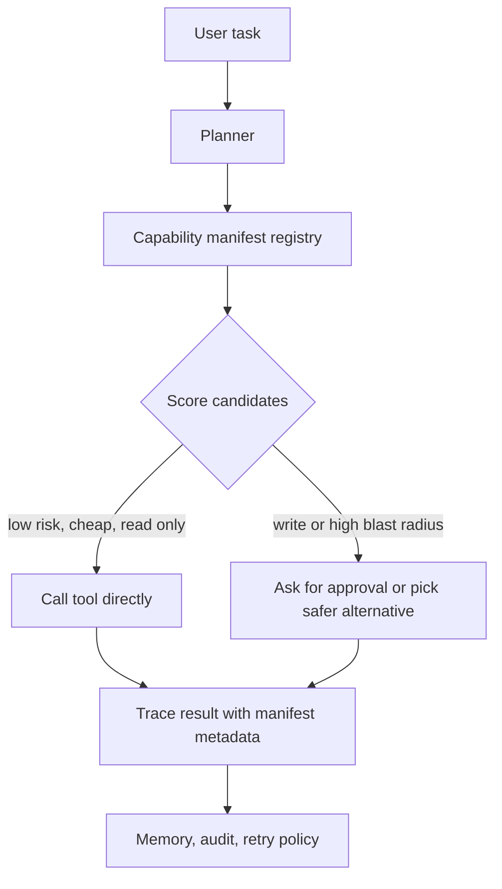

# Tool Capability Manifests for AI Agents That Need to Pick the Right Tool

Agents get weird when every tool looks equally safe.

That is the real failure mode behind a lot of bad tool decisions. A planner sees two options, both described with a name, a schema, and a happy-path description, then reaches for the tool that looks most directly useful. It usually cannot see that one call is read-only and cheap while the other spends money, pages production, mutates state, or requires a human cleanup path.

A capability manifest fixes that missing layer. It gives the planner structured metadata about side effects, approvals, auth, latency, cost, reversibility, and observability. The tool still needs a good schema, but now the agent also gets enough context to decide whether it should call the tool at all.

## Why this matters

Schema validation tells you whether a tool call is well formed. It does **not** tell you whether the tool call is wise.

That distinction matters in production systems where the same agent might have access to a read-only search API, a GitHub write tool, a PagerDuty trigger, and a cloud deployment endpoint. If the planner has no explicit capability metadata, it tends to overvalue the shortest path to an answer.

The result is predictable:

- expensive tools get used for cheap questions
- write tools get used where read tools would have been enough
- rollback paths are discovered after the fact
- reviewers cannot tell whether the tool catalog is actually safe

This is the same reason mature internal platforms publish runbooks, SLOs, and access policies. The interface alone is not enough.

## Architecture or workflow overview



A practical manifest registry usually sits next to the tool adapter layer, not inside the prompt alone. That lets you use the same metadata for planning, approval gating, tracing, and postmortems.

## Implementation details

### 1) Define manifests with decision-grade metadata

A manifest should be short enough to inspect and rich enough to drive policy. I like keeping the tool input schema separate, then attaching operational metadata that planners and runtime policy can both read.

```yaml
name: github.create_pull_request
summary: Open a pull request in GitHub for an already-pushed branch
inputSchemaRef: ./schemas/github.create_pull_request.json
capabilities:
  mode: write
  sideEffects:
    external: true
    reversible: partial
    rollbackHint: close_pr_and_revert_branch
  auth:
    scope: repo
    humanApprovalRequired: true
  cost:
    lane: low
    estimatedDollars: 0.00
  latency:
    p50Ms: 900
    p95Ms: 2600
  reliability:
    idempotent: false
    retryClass: guarded
  observability:
    emitTraceAttrs:
      - repo
      - baseBranch
      - headBranch
  alternatives:
    - github.diff_branch
    - github.draft_pr_summary
```

The important part is not the exact field names. It is the discipline of documenting what the planner actually needs to know.

### 2) Score candidates before the model commits to one

Once manifests exist, you can score tools using a small deterministic layer instead of hoping the model consistently interprets prose the same way.

```ts
interface ToolCandidate {
  name: string;
  semanticFit: number;
  capability: {
    mode: 'read' | 'write';
    approvalRequired: boolean;
    estimatedDollars: number;
    p95Ms: number;
    reversible: 'full' | 'partial' | 'none';
  };
}

export function scoreTool(candidate: ToolCandidate, taskRisk: number) {
  let score = candidate.semanticFit * 100;

  if (candidate.capability.mode === 'write') score -= 18;
  if (candidate.capability.approvalRequired) score -= 10;
  if (candidate.capability.estimatedDollars > 0.10) score -= 8;
  if (candidate.capability.p95Ms > 3000) score -= 6;
  if (candidate.capability.reversible === 'none') score -= 12;

  score -= taskRisk * 5;
  return score;
}
```

This does not replace the model. It narrows the menu so the model stops picking tools that are technically valid but operationally dumb.

### 3) Feed the manifest into tracing and review

The manifest should show up in traces, logs, and approval screens. Otherwise you lose the main operational value of the system.

```json
{
  "trace_id": "3c8df2f9f2f64b5a",
  "tool": "github.create_pull_request",
  "tool_mode": "write",
  "approval_required": true,
  "retry_class": "guarded",
  "estimated_dollars": 0.0,
  "rollback_hint": "close_pr_and_revert_branch",
  "selected_over": [
    "github.diff_branch",
    "github.draft_pr_summary"
  ]
}
```

This becomes extremely useful during incident review because you can answer three questions fast:

1. Why did the planner pick this tool?
2. What safer alternative did it ignore?
3. What guardrail should have stopped it?

## What went wrong and the tradeoffs

### Failure mode 1, the manifest becomes a stale wiki

This happens when manifests live in documentation but not in runtime checks. Engineers stop updating them because nothing breaks when they drift.

**What I would do instead:** fail CI when a tool implementation changes its retry policy, auth scope, or side-effect lane without a manifest update.

### Failure mode 2, everything gets labeled high risk

Teams sometimes react to early mistakes by marking half the catalog as dangerous. That keeps things safe, but the planner loses useful contrast and starts asking for approval too often.

| Approach | Benefit | Cost | When I would use it |
| --- | --- | --- | --- |
| Coarse risk labels only | Fast to launch | Too much ambiguity | Tiny catalogs with few write tools |
| Full capability manifests | Best planner quality and auditability | More maintenance | Shared agent platforms |
| Human-written per-task overrides | Precise for sensitive flows | Hard to scale | Deployments, finance, paging |

A manifest should create **better gradients**, not just more red tape.

### Failure mode 3, side effects are hidden behind "read" tools

This is the sneaky one. A tool might look informational but still mutate state through caching, analytics writes, or implicit server-side sessions. If you do not capture that in the manifest, your approval model is fiction.

> **Pitfall:** "Read-only" should mean no user-visible or system-visible mutation worth auditing. If the backend writes durable state, label it honestly.

### Security and reliability concern

Capability metadata is part of your trust boundary. If the model can rewrite the manifest or if tool servers can self-report unchecked metadata at runtime, an attacker can try to downgrade a dangerous tool into a harmless-looking one.

Best practice is simple:

- store manifests in reviewed code or signed registry data
- validate them server-side before exposure to the planner
- separate tool description text from enforcement policy
- bind approval UI to the same manifest source the runtime enforces

## Practical checklist

Use this if you are adding manifests to an existing agent platform:

- [ ] classify every tool as read, write, or mixed
- [ ] document irreversible or partially reversible side effects
- [ ] record auth scope and whether human approval is required
- [ ] add rough latency and cost lanes, even if they are hand-estimated at first
- [ ] define retry class, especially for non-idempotent tools
- [ ] expose safer alternatives in the manifest for planner comparison
- [ ] emit manifest fields into traces and approval screens
- [ ] add CI checks so manifest drift is visible

> **Best practice:** start with the ten tools that matter most operationally. A partial registry with real enforcement is much better than a perfect spreadsheet nobody uses.

## Conclusion

Tool schemas tell the agent how to call something. Capability manifests tell it whether calling that thing is a good idea.

If you want agents to make saner choices under cost, risk, and approval constraints, this is one of the highest-leverage layers you can add.

## References

- [Model Context Protocol, tools concept](https://modelcontextprotocol.io)
- [JSON Schema](https://json-schema.org/)
- [OpenTelemetry semantic conventions](https://opentelemetry.io/docs/specs/semconv/)
- [OpenAPI Specification](https://spec.openapis.org/oas/latest.html)
