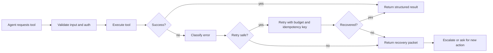

# Tool Error Handling Patterns for AI Agents That Fail Loudly and Recover Cleanly

Tool-calling agents rarely break because the model cannot produce JSON. They break because the system treats every failure the same way.

A timeout gets retried even though the tool already committed the write. A validation error gets buried in a generic `tool failed` message. A rate limit becomes a hot loop that turns one bad minute into an outage. That is the failure pattern this post is about.

Here is the practical workflow I would use: classify tool failures, attach structured recovery hints, retry only when the side effects are safe, and escalate with a packet a human can act on immediately.

## Why this matters

Once an agent can call tools that hit real systems, error handling stops being plumbing. It becomes the control surface for reliability, cost, and safety.

A useful tool layer should answer four questions fast:

1. Did the action happen?
2. Is retry safe?
3. What context should the model see next?
4. When should a human take over?

If your platform cannot answer those four questions, the agent will improvise, and that is how quiet failures turn into duplicate writes, phantom retries, and reviewer confusion.

> **Best practice:** Make the tool runtime more opinionated than the model. The model should not guess whether a failed write partially succeeded.

## Architecture or workflow overview



The important bit is that the classifier sits after execution, not just before it. Plenty of failures are only meaningful once you know whether a write was attempted, whether a lease expired, or whether the remote endpoint acknowledged anything.

## Implementation details

### 1) Define an error envelope the model can reason about

Do not return a flat exception string. Return an error object with fields that drive the next step.

```json
{
  "ok": false,
  "tool": "deploy_preview",
  "error": {
    "code": "RATE_LIMITED",
    "retryable": true,
    "sideEffectState": "unknown",
    "humanActionRequired": false,
    "retryAfterMs": 15000,
    "summary": "GitHub API secondary rate limit hit while creating deployment status",
    "recoveryHint": "Wait for retryAfterMs and reuse the same idempotency key",
    "traceId": "toolrun_01hzyw3w5a"
  }
}
```

The `sideEffectState` field matters a lot. I like three values:

- `none`: the operation definitely did not happen
- `unknown`: the operation may have happened, verify before retry
- `committed`: the side effect happened, do not retry as if nothing occurred

### 2) Separate error classification from retry policy

A classifier should identify what happened. A retry policy should decide what to do about it.

```python
from dataclasses import dataclass

@dataclass
class ToolErrorInfo:
    code: str
    retryable: bool
    side_effect_state: str
    human_action_required: bool
    retry_after_ms: int | None = None


def classify_tool_error(exc: Exception) -> ToolErrorInfo:
    if isinstance(exc, TimeoutError):
        return ToolErrorInfo(
            code="TIMEOUT",
            retryable=True,
            side_effect_state="unknown",
            human_action_required=False,
            retry_after_ms=2000,
        )
    if isinstance(exc, PermissionError):
        return ToolErrorInfo(
            code="PERMISSION_DENIED",
            retryable=False,
            side_effect_state="none",
            human_action_required=True,
        )
    if "rate limit" in str(exc).lower():
        return ToolErrorInfo(
            code="RATE_LIMITED",
            retryable=True,
            side_effect_state="none",
            human_action_required=False,
            retry_after_ms=15000,
        )
    return ToolErrorInfo(
        code="UNKNOWN",
        retryable=False,
        side_effect_state="unknown",
        human_action_required=True,
    )
```

This keeps policy drift under control. Otherwise every tool grows its own retry folklore.

### 3) Retry only with idempotency and a budget

If a write tool can be retried, it should carry an idempotency key and a hard retry budget.

```python
def execute_with_retry(tool_fn, args, *, idempotency_key: str, max_attempts: int = 3):
    attempt = 0
    while attempt < max_attempts:
        attempt += 1
        try:
            return tool_fn(**args, idempotency_key=idempotency_key)
        except Exception as exc:
            info = classify_tool_error(exc)
            if not info.retryable:
                raise
            if info.side_effect_state == "committed":
                raise RuntimeError("write already committed, refusing blind retry") from exc
            if attempt == max_attempts:
                raise
```

If the tool cannot accept idempotency keys, I would be very conservative about automatic retries for writes.

### 4) Return a recovery packet, not just an error

A recovery packet is the thing that lets the model or human continue without re-reading logs.

```yaml
recovery_packet:
  trace_id: toolrun_01hzyw3w5a
  tool: deploy_preview
  failed_step: create_deployment_status
  safe_next_actions:
    - "verify whether preview URL already exists"
    - "reuse idempotency key if retrying"
    - "wait 15s before next API call"
  unsafe_next_actions:
    - "do not create a new deployment record"
    - "do not delete the existing preview env"
  suggested_prompt: "Check deployment status for trace toolrun_01hzyw3w5a before trying again."
```

That packet is far more useful than another natural-language apology from the model.

## What went wrong and the tradeoffs

The biggest mistake I see is retrying by transport symptom instead of business risk. A timeout is not automatically safe to replay. For read tools, aggressive retries are usually fine. For write tools, they can be actively dangerous.

| Pattern | Best for | Upside | Downside |
| --- | --- | --- | --- |
| Blind retries | Read-only or idempotent operations | Simple to implement | Causes duplicate writes and noisy incidents |
| Classified retries | Mixed tool fleets with writes | Safer recovery, lower hidden risk | More runtime design work |
| Human-only recovery | High-risk money, infra, or destructive ops | Strongest safety | Slower loops and more interruptions |

### Failure modes worth planning for

- **Timeout after commit**: the remote system wrote state, but your caller never saw the ack.
- **Rate-limit storm**: multiple agents retry together and create their own outage.
- **Permission drift**: cached assumptions about tool access become stale mid-run.
- **Prompt contamination**: the model sees raw stack traces and invents the wrong remediation path.

> **Pitfall:** Never pass huge raw exception blobs straight back into the model if they contain secrets, tokens, or confusing transport noise. Summarize, redact, and attach the trace ID.

## Terminal output I actually want

```text
[toolrun_01hzyw3w5a] deploy_preview
status: failed
code: RATE_LIMITED
retryable: true
sideEffectState: none
retryAfterMs: 15000
safe_next_action: retry with same idempotency key
unsafe_next_action: create a second deployment record
```

That is enough context to act without opening three dashboards.

## Practical checklist or decision framework

- [ ] Every tool returns a structured success or error envelope
- [ ] Error classification is centralized, not tool-specific folklore
- [ ] Write tools support idempotency keys or explicit no-retry policy
- [ ] Retry budgets are finite and visible
- [ ] Recovery packets include safe and unsafe next actions
- [ ] Human escalation paths include trace IDs and summarized context
- [ ] Raw errors are redacted before they go back into the prompt

## What I would do again

1. Keep the error taxonomy small enough that engineers actually use it.
2. Add `sideEffectState` before adding clever retry logic.
3. Treat rate limits and permission failures as product behavior, not edge cases.
4. Log recovery packets as first-class artifacts for incident review.

## Conclusion

Reliable tool-calling agents do not just need good tools. They need good failure semantics. If you classify errors, retry with discipline, and hand back recovery context instead of noise, the agent stops feeling haunted and starts behaving like real software.

## References

- [MCP overview](https://modelcontextprotocol.io)
- [Stripe on idempotent requests](https://stripe.com/docs/api/idempotent_requests)
- [Google SRE book, handling overload](https://sre.google/sre-book/handling-overload/)
