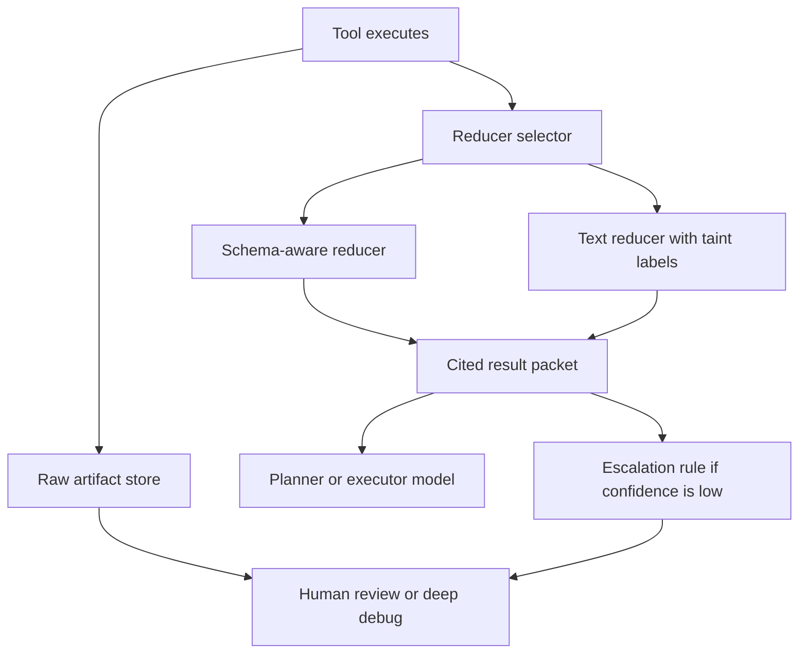

# Tool Output Reduction Layers for AI Agents Without Losing the Important Bits

Most tool-heavy agents fail in a boring way. They are not missing a better model. They are drowning the model in raw output from `kubectl`, `gh`, `terraform`, logs, JSON payloads, and shell transcripts that should never have gone back into the prompt unchanged.

That creates two problems at once. First, context fills up with low-signal noise. Second, tainted external text gets another chance to steer the agent. The result is slower runs, weaker decisions, and summaries that somehow hide the one line you actually needed.

A better pattern is a reduction layer between tool execution and model context. Instead of feeding raw output back into the loop, reduce it into typed fields, bounded excerpts, citations, and escalation signals. This post walks through a practical implementation that keeps the useful evidence without paying to re-prompt the entire transcript.

## Why this matters

Tool output is one of the easiest ways to quietly ruin an otherwise decent agent system. It usually starts with convenience. A tool returns text, the orchestrator appends that text to the conversation, and things look fine until a few long runs later.

In production, this shows up as:

- token spend creeping up because every step carries previous step output
- important signals buried inside 400 lines of logs
- prompt-injection risk when untrusted content comes from web pages, CI logs, or tickets
- bad retries because the model reasons over stale or partial output instead of structured state

This is the same lesson behind structured logging and metrics. Raw text is useful for humans during incident review. It is not the best runtime substrate for the next automated decision.

Direct references worth reading here:

- Model Context Protocol, for tool-oriented agent patterns: <https://modelcontextprotocol.io/introduction>
- OpenTelemetry, for thinking about evidence and traces separately from summaries: <https://opentelemetry.io/docs/>
- jq, for practical reduction of noisy JSON tool output: <https://jqlang.org/>

> **Best-practice callout:** Treat raw tool output as an artifact to store and cite, not the default thing to re-inject into the next model turn.

## Architecture or workflow overview

### Mermaid flow



### Numbered sequence

1. Run the tool and capture the full raw output as an immutable artifact.
2. Attach metadata such as tool name, trust lane, byte size, exit status, and source URL if relevant.
3. Choose a reducer based on output type, size, and safety lane.
4. Produce a bounded result packet with typed fields, summary bullets, citations, and truncation notes.
5. Feed the packet, not the raw blob, into the next model step.
6. Escalate to human review or artifact fetch when the packet loses too much confidence or precision.

## Implementation details

### 1) Store raw output, but do not pass it through by default

I like making raw output a first-class artifact with an ID. That keeps the evidence available for debugging without forcing every downstream model call to pay for it.

```json
{
  "artifact_id": "toolrun_01jw4x9m5k6r_logs",
  "tool": "kubectl.logs",
  "created_at": "2026-05-26T12:05:00Z",
  "content_type": "text/plain",
  "trust_lane": "external-runtime",
  "bytes": 184392,
  "sha256": "8c57d3...",
  "retention": "7d"
}
```

That metadata is already more useful than a raw transcript pasted back into chat. It lets policy decide whether the next step should see a reducer packet, a quoted excerpt, or nothing.

### 2) Build reducer contracts per tool family

Reducers should not be one generic summarizer prompt. They should be small contracts that know what matters for a given tool family.

```python
from dataclasses import dataclass
from typing import Any

@dataclass
class ReducedPacket:
    summary: list[str]
    fields: dict[str, Any]
    citations: list[dict[str, Any]]
    tainted: bool
    truncated: bool
    confidence: float


def reduce_github_pr(payload: dict) -> ReducedPacket:
    checks = payload.get("statusCheckRollup", [])
    failing = [c for c in checks if c.get("conclusion") not in ("SUCCESS", None)]
    reviewers = [r["login"] for r in payload.get("latestReviews", []) if r.get("state") == "CHANGES_REQUESTED"]

    return ReducedPacket(
        summary=[
            f"PR #{payload['number']} is {payload['state'].lower()}",
            f"{len(failing)} checks are failing",
            f"changes requested by: {', '.join(reviewers) if reviewers else 'none'}",
        ],
        fields={
            "pr_number": payload["number"],
            "title": payload["title"],
            "failing_checks": [c.get("name") for c in failing],
            "reviewers_requesting_changes": reviewers,
        },
        citations=[{"path": "statusCheckRollup", "kind": "json-pointer"}, {"path": "latestReviews", "kind": "json-pointer"}],
        tainted=False,
        truncated=False,
        confidence=0.97,
    )
```

The key point is that the model receiving this packet can reason over stable fields instead of rediscovering the same facts from a large payload every time.

### 3) Reduce unstructured text into bounded evidence, not vibes

For logs and shell output, I prefer a reducer that extracts the shape of the failure and then preserves only the lines needed to support it.

```python
import re

ERROR_PATTERNS = [
    re.compile(r"\bERROR\b"),
    re.compile(r"\bTraceback\b"),
    re.compile(r"\bpanic:\b"),
]


def reduce_text_output(text: str) -> dict:
    lines = text.splitlines()
    hits = []
    for idx, line in enumerate(lines, start=1):
        if any(p.search(line) for p in ERROR_PATTERNS):
            window = lines[max(0, idx - 3): min(len(lines), idx + 2)]
            hits.append({
                "line": idx,
                "excerpt": window,
            })

    return {
        "summary": [
            f"captured {len(lines)} lines",
            f"found {len(hits)} error windows",
        ],
        "citations": hits[:5],
        "truncated": len(hits) > 5,
        "tainted": True,
    }
```

That is not glamorous, but it works. A five-line cited window around the real error is far more valuable than replaying 2,000 lines of container logs into the next step.

### 4) Carry truncation and trust signals forward

Reducers should admit when they might be hiding something. If the packet is partial, say so explicitly.

```yaml
tool: web.fetch
packet:
  summary:
    - "Page contains a pricing comparison table for hosted vector databases"
    - "Three providers mentioned in the visible excerpt"
  fields:
    providers: ["Pinecone", "Weaviate", "pgvector"]
  citations:
    - kind: line-range
      start: 88
      end: 121
  tainted: true
  truncated: true
  confidence: 0.62
  escalation:
    recommended: true
    reason: "Long external page reduced to one excerpt window"
```

This matters because reducers are lossy by design. The right goal is not perfect compression. It is honest compression with a clear path back to the source artifact.

### Example terminal-output visual

```text
$ agent-run inspect toolrun_01jw4x9m5k6r_logs
artifact: toolrun_01jw4x9m5k6r_logs
source: kubectl.logs
bytes: 184392
reducer: text-error-window-v2
packet size: 812 bytes
confidence: 0.74
tainted: true
truncated: true
escalation: artifact fetch required before auto-remediation
```

That terminal block is the behavior I want. The model gets a compact packet, while operators still have a clean path to the source evidence.

## What went wrong, and the tradeoffs

### Failure mode 1: the reducer removes the clue you needed

This is the obvious risk. If the reduction layer is too aggressive, the agent becomes fast and confidently wrong.

What helps:

- attach citations to every important claim
- propagate a confidence score and truncation flag
- let reducers request artifact fetch when the packet is too lossy

### Failure mode 2: reducers become prompt-injection laundromats

A reducer is not magically safe because it is shorter. If it paraphrases malicious tool output without taint labels, you still have untrusted text steering the agent, just in a tidier form.

What helps:

- preserve trust-lane metadata from the original tool source
- mark summaries of untrusted content as tainted
- prevent tainted packets from directly triggering write actions without another policy gate

### Failure mode 3: every tool gets the same summarizer

This is a subtle quality problem. A generic summarizer tends to flatten meaning. CI logs, GitHub PR metadata, Terraform plans, and RAG traces each need different reduction rules.

What helps:

- group reducers by tool family
- prefer typed extraction before free-text summarization
- log reducer version so you can evaluate regressions later

### Tradeoff table

| Pattern | Good at | Weak at | I would use it when |
|---|---|---|---|
| Raw output passthrough | Maximum fidelity | Token bloat, safety risk, low signal | Human-only debugging in short runs |
| Generic summarizer | Fast to ship | Drops structure, inconsistent quality | Temporary stopgap while contracts mature |
| Schema-aware reducers | Stable fields and low noise | More implementation effort | Core tools appear in many workflows |
| Artifact plus cited packet | Good balance of cost, safety, debugability | Needs storage and retrieval plumbing | Production agent systems with long runs |

### Security and reliability concerns

There are two concerns I would not downplay.

First, reducers are part of the trusted computing base. A bad reducer can hide a risky line as effectively as a bad model can miss it. Version them, test them, and keep examples of known bad outputs.

Second, raw artifacts may contain secrets, tokens, or user data. If you store them for later citation, storage policy matters just as much as prompt policy. Redaction, retention windows, and access controls need to exist before the artifact cache quietly becomes your most sensitive datastore.

> **Pitfalls section:**
>
> - Do not let reducers emit unsupported conclusions without a citation.
> - Do not mix trusted internal outputs and tainted external content in one unlabeled packet.
> - Do not hide truncation just because the short answer looked plausible.
> - Do not assume JSON equals safe. Structured payloads can still carry hostile instructions in string fields.

## Practical checklist

### What I would do again

- Store raw tool output as an artifact with an ID and retention policy.
- Feed reduced packets to the next model step by default.
- Prefer typed field extraction before prose summarization.
- Preserve citations, truncation flags, and taint labels.
- Escalate to artifact fetch when confidence is low or the action is high risk.
- Version reducers and test them against known bad examples.

### What I would not do

- I would not pipe full logs back into the planner just because it is easy.
- I would not use one generic summarizer prompt for every tool in the system.
- I would not allow tainted packets to authorize write operations on their own.
- I would not retain raw artifacts indefinitely without redaction and access controls.

## Conclusion

Tool-heavy agents do better when raw output stops being the default context format. Store the evidence, reduce it into typed packets, and make the lossiness visible.

That one architectural move usually improves three things at once: cost, reviewability, and safety. It is not flashy, but I think it is one of the highest-leverage habits in practical agent engineering.
