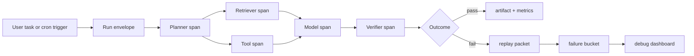

# Trace-Driven Debugging for Multi-Step AI Agent Failures

When an AI agent fails on step seven, the prompt is usually not the real problem. The real problem is that nobody can answer three boring questions fast enough: what happened, where it happened, and whether the run can be replayed without guessing.

Flat logs are terrible at this. They show fragments of tool calls, retries, and model outputs, but not the causal path through the run. That is how incidents turn into prompt superstition.

A better pattern is trace-driven debugging. Give every run a stable trace ID, attach useful attributes to each span, keep a replay packet for the failing path, and bucket failures by where they broke instead of by which model was involved.

In this post, I will walk through a debugging workflow that makes multi-step agent failures much easier to explain, replay, and fix.

## Why this matters

Agent failures are rarely one bad completion. They are usually chain failures: retrieval returned weak evidence, the planner overcommitted, a tool timed out, the model improvised, and the verifier approved too little.

In production, that means three things matter more than a pretty demo:

- **Causality:** you need the exact run path, not a pile of unrelated logs.
- **Replayability:** you need a compact packet that reproduces the failure shape.
- **Bucketing:** you need to know whether you have a retrieval problem, tool problem, routing problem, or verifier problem.

## Architecture or workflow overview



1. Start each run with a single trace ID.
2. Wrap planner, retrieval, tool, model, and verifier steps in spans.
3. Persist the failing branch as a replay packet.
4. Classify the failure before humans start guessing.

## Implementation details

### 1) Make the trace envelope cheap and mandatory

I like a tiny run envelope that exists before any model call starts. It should be easy to create, easy to search, and impossible for downstream steps to skip.

```python
from dataclasses import dataclass
from datetime import datetime, timezone
import uuid

@dataclass
class RunEnvelope:
    trace_id: str
    run_id: str
    workflow: str
    actor: str
    started_at: str


def new_envelope(workflow: str, actor: str) -> RunEnvelope:
    return RunEnvelope(
        trace_id=str(uuid.uuid4()),
        run_id=str(uuid.uuid4()),
        workflow=workflow,
        actor=actor,
        started_at=datetime.now(timezone.utc).isoformat(),
    )
```

This looks almost too simple, which is the point. If trace setup is heavyweight, someone will bypass it during the next rushed incident.

### 2) Annotate spans with facts that survive postmortems

The most useful spans are not the most verbose ones. They are the ones that answer why a step existed, what inputs shaped it, and what happened next.

```ts
import { trace, SpanStatusCode } from "@opentelemetry/api";

const tracer = trace.getTracer("agent-runtime");

export async function runToolStep(name: string, args: Record<string, unknown>) {
  return tracer.startActiveSpan(`tool:${name}`, async span => {
    span.setAttribute("tool.name", name);
    span.setAttribute("tool.arg_keys", Object.keys(args).join(","));
    span.setAttribute("agent.retry_count", 0);

    try {
      const result = await invokeTool(name, args);
      span.setAttribute("tool.success", true);
      span.setAttribute("tool.result_size", JSON.stringify(result).length);
      span.end();
      return result;
    } catch (error) {
      span.recordException(error as Error);
      span.setStatus({ code: SpanStatusCode.ERROR, message: "tool failed" });
      span.setAttribute("tool.success", false);
      span.end();
      throw error;
    }
  });
}
```

A good rule is to annotate what changes debugging decisions: cache hit or miss, retry count, selected model lane, token budget, retrieved document count, tool name, timeout class, verifier verdict.

### 3) Store a replay packet for the failing path

If the only artifact you keep is a red trace, humans still have to reconstruct state from logs. That is slow and error-prone. Keep one replay packet per failed run with sanitized inputs, tool outputs, and routing context.

```json
{
  "trace_id": "d2c9dca8-1c59-49f3-a0d1-9e660f9be0aa",
  "workflow": "repo-fix-agent",
  "selected_model": "strong",
  "task_summary": "fix flaky S3 backfill job",
  "retrieval_refs": ["docs/backfill.md", "src/jobs/s3.ts"],
  "tool_events": [
    { "tool": "rg", "exit_code": 0 },
    { "tool": "pytest", "exit_code": 1 }
  ],
  "verifier": { "passed": false, "reason": "regression in retry path" }
}
```

The packet should be small enough to hand to a developer or an offline eval job. If it is bloated with entire repositories and raw external payloads, nobody will use it.

```text
$ agent-debug replay replay/2026-05-04/d2c9dca8.json
trace_id: d2c9dca8-1c59-49f3-a0d1-9e660f9be0aa
workflow: repo-fix-agent
selected_model: strong
replayed_steps: planner -> retriever -> tool:pytest -> verifier
failure_bucket: verifier_false_positive
next_action: tighten invariant checks before retry
```

### 4) Bucket failures before you tune prompts

A lot of teams label every failure as “the model messed up.” That is lazy bookkeeping. The model may be involved, but the fix often belongs elsewhere.

| Failure bucket | What it usually means | First thing I check | What I would not do |
| --- | --- | --- | --- |
| Retrieval miss | The agent never saw the right evidence | Query terms, filters, ranking | Re-prompt the model harder |
| Tool execution | Command or API call failed mid-run | Timeouts, auth, arg validation | Increase temperature |
| Planner drift | Early plan created bad downstream work | task manifest, decomposition, constraints | Add more tools immediately |
| Verifier false positive | Weak checks approved bad output | invariant coverage, shadow tests | Trust the same verifier twice |
| Routing mistake | Wrong model lane or token budget | risk score, context packet, escalation rule | Blame latency alone |

That table saves a surprising amount of wasted time because it turns “this run felt weird” into an actual debugging branch.

## What went wrong and the tradeoffs

The first failure mode is over-instrumentation. Teams attach huge prompts, full tool outputs, and sensitive payloads to every span, then wonder why traces are expensive and risky. Debuggability matters, but so do redaction and storage discipline.

> **Pitfall:** never dump raw secrets, full customer documents, or arbitrary external HTML into tracing backends. Keep pointers, hashes, and sanitized summaries instead.

The second failure mode is missing causal links between retries. If retry attempt three starts a fresh trace without a parent span or shared trace ID, your dashboard lies. It looks like three unrelated events instead of one failing run.

Another tradeoff is sampling. Full-fidelity tracing on every successful run can get expensive. My bias is to sample lightly for healthy traffic, but keep full traces for failures, escalations, and slow runs.

> **Best practice:** use dynamic sampling, retain all error traces, and keep replay packets only for runs that humans may need to inspect again.

There is also a security concern here. Replay packets are effectively compact incident artifacts. If they include tool arguments, repo paths, or snippets from external sources, they need the same access controls as logs and CI artifacts.

## Practical checklist

- [ ] Generate a trace ID before the first planner or model step
- [ ] Wrap planner, retrieval, tool, model, and verifier stages in spans
- [ ] Record retry count, route choice, and verifier verdict as span attributes
- [ ] Store one sanitized replay packet for each failed or escalated run
- [ ] Bucket failures by subsystem before editing prompts
- [ ] Retain all error traces and sample healthy runs more aggressively
- [ ] Redact secrets and untrusted external content before persistence

## What I would do again

I would absolutely keep the replay packet pattern. It turns debugging from archaeology into reproduction. I would also keep the failure buckets small and boring. Five good buckets are more useful than twenty vague ones.

## Conclusion

Multi-step agent failures stop feeling mystical once the run has a trace ID, the spans carry useful facts, and the failing branch can be replayed without guesswork. Debug the path, not the prompt folklore.

## References

- [OpenTelemetry documentation](https://opentelemetry.io/docs/)
- [Arize OpenInference tracing concepts](https://arize.com/docs/ax/openinference/overview)
- [Langfuse tracing guide](https://langfuse.com/docs/tracing)
- [Honeycomb guide to distributed tracing](https://www.honeycomb.io/blog/beginners-guide-to-distributed-tracing)
