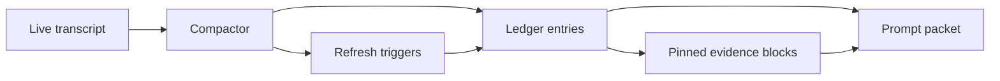

# Transcript Compaction Ledgers for Long-Running AI Coding Agents

Long-running coding agents usually fail in a boring way. They do not become spectacularly wrong all at once. They slowly accumulate old transcript state, stale assumptions, repeated logs, and too many half-relevant details until every next tool call gets slower and less trustworthy.

The fix is not a bigger context window. The fix is a better memory shape. A transcript compaction ledger keeps the durable facts, decisions, risks, and pinned evidence that matter for the next turn, then lets the rest age out.

In this post I will show a practical ledger design, when to compact, what to pin, what to throw away, and how to keep verifier failures from being buried under conversational sludge.

## Why this matters

If an agent session lasts 30 to 90 minutes, the transcript starts mixing three very different things:

1. durable project state
2. temporary debugging chatter
3. tool output that was useful once but is now just token ballast

That mixture causes three common problems:

- the model keeps seeing stale plans after the repo changed
- critical evidence gets lost inside raw logs
- the prompt budget goes to transcript replay instead of fresh code or verifier output

This gets more painful in shell-first coding systems, long bug hunts, and review loops where the agent needs to remember what was tried without re-reading every failed attempt.

## Architecture or workflow overview

![Transcript compaction ledger architecture](data:image/svg+xml,%3Csvg%20xmlns%3D%27http%3A//www.w3.org/2000/svg%27%20viewBox%3D%270%200%20960%20420%27%3E%3Crect%20width%3D%27960%27%20height%3D%27420%27%20rx%3D%2724%27%20fill%3D%27%2308111c%27/%3E%3Crect%20x%3D%2738%27%20y%3D%2768%27%20width%3D%27190%27%20height%3D%2788%27%20rx%3D%2718%27%20fill%3D%27%230f1d31%27%20stroke%3D%27%2338bdf8%27%20stroke-opacity%3D%270.45%27/%3E%3Ctext%20x%3D%27133%27%20y%3D%27104%27%20text-anchor%3D%27middle%27%20fill%3D%27white%27%20font-family%3D%27Arial%2C%20sans-serif%27%20font-size%3D%2724%27%20font-weight%3D%27700%27%3Elive%20transcript%3C/text%3E%3Ctext%20x%3D%27133%27%20y%3D%27132%27%20text-anchor%3D%27middle%27%20fill%3D%27%2393c5fd%27%20font-family%3D%27Arial%2C%20sans-serif%27%20font-size%3D%2718%27%3Eraw%20turns%2C%20noisy%20detail%3C/text%3E%3Crect%20x%3D%27278%27%20y%3D%2768%27%20width%3D%27190%27%20height%3D%2788%27%20rx%3D%2718%27%20fill%3D%27%230f1d31%27%20stroke%3D%27%2338bdf8%27%20stroke-opacity%3D%270.45%27/%3E%3Ctext%20x%3D%27373%27%20y%3D%27104%27%20text-anchor%3D%27middle%27%20fill%3D%27white%27%20font-family%3D%27Arial%2C%20sans-serif%27%20font-size%3D%2724%27%20font-weight%3D%27700%27%3Ecompactor%3C/text%3E%3Ctext%20x%3D%27373%27%20y%3D%27132%27%20text-anchor%3D%27middle%27%20fill%3D%27%2393c5fd%27%20font-family%3D%27Arial%2C%20sans-serif%27%20font-size%3D%2718%27%3Esummaries%20%2B%20fact%20extraction%3C/text%3E%3Crect%20x%3D%27518%27%20y%3D%2768%27%20width%3D%27190%27%20height%3D%2788%27%20rx%3D%2718%27%20fill%3D%27%230f1d31%27%20stroke%3D%27%2338bdf8%27%20stroke-opacity%3D%270.45%27/%3E%3Ctext%20x%3D%27613%27%20y%3D%27104%27%20text-anchor%3D%27middle%27%20fill%3D%27white%27%20font-family%3D%27Arial%2C%20sans-serif%27%20font-size%3D%2724%27%20font-weight%3D%27700%27%3Eledger%3C/text%3E%3Ctext%20x%3D%27613%27%20y%3D%27132%27%20text-anchor%3D%27middle%27%20fill%3D%27%2393c5fd%27%20font-family%3D%27Arial%2C%20sans-serif%27%20font-size%3D%2718%27%3Efacts%2C%20tasks%2C%20evidence%3C/text%3E%3Crect%20x%3D%27732%27%20y%3D%2768%27%20width%3D%27190%27%20height%3D%2788%27%20rx%3D%2718%27%20fill%3D%27%230f1d31%27%20stroke%3D%27%23a78bfa%27%20stroke-opacity%3D%270.45%27/%3E%3Ctext%20x%3D%27827%27%20y%3D%27104%27%20text-anchor%3D%27middle%27%20fill%3D%27white%27%20font-family%3D%27Arial%2C%20sans-serif%27%20font-size%3D%2724%27%20font-weight%3D%27700%27%3Enext%20prompt%3C/text%3E%3Ctext%20x%3D%27827%27%20y%3D%27132%27%20text-anchor%3D%27middle%27%20fill%3D%27%23ddd6fe%27%20font-family%3D%27Arial%2C%20sans-serif%27%20font-size%3D%2718%27%3Esmall%20context%20packet%3C/text%3E%3Crect%20x%3D%27278%27%20y%3D%27236%27%20width%3D%27190%27%20height%3D%2788%27%20rx%3D%2718%27%20fill%3D%27%230f1d31%27%20stroke%3D%27%2322d3ee%27%20stroke-opacity%3D%270.45%27/%3E%3Ctext%20x%3D%27373%27%20y%3D%27272%27%20text-anchor%3D%27middle%27%20fill%3D%27white%27%20font-family%3D%27Arial%2C%20sans-serif%27%20font-size%3D%2724%27%20font-weight%3D%27700%27%3Erefresh%20triggers%3C/text%3E%3Ctext%20x%3D%27373%27%20y%3D%27300%27%20text-anchor%3D%27middle%27%20fill%3D%27%23bae6fd%27%20font-family%3D%27Arial%2C%20sans-serif%27%20font-size%3D%2718%27%3Everifier%20fail%2C%20file%20drift%2C%20TTL%3C/text%3E%3Crect%20x%3D%27518%27%20y%3D%27236%27%20width%3D%27190%27%20height%3D%2788%27%20rx%3D%2718%27%20fill%3D%27%230f1d31%27%20stroke%3D%27%2322d3ee%27%20stroke-opacity%3D%270.45%27/%3E%3Ctext%20x%3D%27613%27%20y%3D%27272%27%20text-anchor%3D%27middle%27%20fill%3D%27white%27%20font-family%3D%27Arial%2C%20sans-serif%27%20font-size%3D%2724%27%20font-weight%3D%27700%27%3Epinned%20blocks%3C/text%3E%3Ctext%20x%3D%27613%27%20y%3D%27300%27%20text-anchor%3D%27middle%27%20fill%3D%27%23bae6fd%27%20font-family%3D%27Arial%2C%20sans-serif%27%20font-size%3D%2718%27%3Elogs%2C%20diffs%2C%20owner%20notes%3C/text%3E%3Cpath%20d%3D%27M228%20112%20H278%27%20stroke%3D%27%2367e8f9%27%20stroke-width%3D%274%27/%3E%3Cpath%20d%3D%27M468%20112%20H518%27%20stroke%3D%27%2367e8f9%27%20stroke-width%3D%274%27/%3E%3Cpath%20d%3D%27M708%20112%20H732%27%20stroke%3D%27%23a78bfa%27%20stroke-width%3D%274%27/%3E%3Cpath%20d%3D%27M373%20156%20V236%27%20stroke%3D%27%2367e8f9%27%20stroke-width%3D%274%27/%3E%3Cpath%20d%3D%27M613%20156%20V236%27%20stroke%3D%27%2367e8f9%27%20stroke-width%3D%274%27/%3E%3Cpath%20d%3D%27M468%20280%20H518%27%20stroke%3D%27%2367e8f9%27%20stroke-width%3D%274%27/%3E%3Cpath%20d%3D%27M708%20280%20C770%20280%2C%20790%20190%2C%20827%20156%27%20stroke%3D%27%23a78bfa%27%20stroke-width%3D%274%27%20fill%3D%27none%27/%3E%3C/svg%3E)



The key design choice is simple: treat the raw transcript as an event stream, not as the context packet itself.

A useful ledger usually contains four buckets:

- **session facts**: branch, changed files, current objective, constraints
- **decision log**: what was attempted, what was rejected, and why
- **pinned evidence**: exact logs, diffs, commands, or file excerpts worth preserving verbatim
- **refresh metadata**: TTLs, drift checks, verifier failures, and invalidation triggers

## Implementation details

### 1. Define a ledger schema that separates facts from evidence

The compactor should not dump one giant summary blob. It should emit typed entries you can score, pin, expire, and rehydrate.

```yaml
ledger:
  sessionFacts:
    branch: master
    objective: "stabilize transcript compaction worker"
    changedFiles:
      - src/compactor.ts
      - tests/ledger.test.ts
  decisions:
    - id: dec_014
      claim: "Dropped raw npm install logs after extracting failing package name"
      confidence: medium
      sourceTurns: [81, 82]
      expiresAfterTurns: 12
  pinnedEvidence:
    - id: ev_021
      kind: verifier-output
      whyPinned: "last failing assertion still unresolved"
      contentRef: artifacts/jest-failure.txt
  refreshTriggers:
    repoFingerprint: 2f40d5f
    refreshOn:
      - verifier_failure
      - changed_file_not_in_packet
      - decision_ttl_expired
```

This layout makes one tradeoff explicit: only the evidence that must survive gets preserved verbatim. Everything else becomes a smaller typed fact.

### 2. Compact turns into scored entries

A compactor can run after every N turns or after high-noise tool events. The main job is to demote conversational noise and promote durable state.

```ts
type Turn = { id: number; role: 'user' | 'assistant' | 'tool'; text: string; tags?: string[] };
type LedgerEntry = {
  id: string;
  bucket: 'fact' | 'decision' | 'evidence';
  summary: string;
  score: number;
  ttlTurns: number;
  pinned?: boolean;
};

export function compactTurns(turns: Turn[]): LedgerEntry[] {
  return turns.flatMap((turn) => {
    if (turn.role === 'tool' && turn.text.length > 2000) {
      return [{
        id: `e_${turn.id}`,
        bucket: 'evidence',
        summary: extractVerifierSignal(turn.text),
        score: 0.82,
        ttlTurns: 8,
        pinned: /FAIL|AssertionError|panic/i.test(turn.text)
      }];
    }

    if (turn.tags?.includes('decision')) {
      return [{
        id: `d_${turn.id}`,
        bucket: 'decision',
        summary: turn.text,
        score: 0.74,
        ttlTurns: 12
      }];
    }

    return [];
  });
}
```

What I like about this pattern is that it stays inspectable. You can explain why something survived compaction instead of pretending the summary model just “knows”.

### 3. Rebuild the prompt packet from the ledger, not the full transcript

The next prompt should be assembled from the ledger with a budget. Facts first, pinned evidence second, recent raw turns last.

```text
$ agent-context build --max-tokens 9000
[budget] facts=1400 decisions=1200 pinned_evidence=3400 recent_turns=2000 slack=1000
[packet] included 6 session facts
[packet] included 4 active decisions
[packet] included 2 pinned verifier blocks
[packet] included 3 recent turns
[packet] dropped 17 expired entries
```

This is usually where teams overcomplicate the system. You do not need a perfect memory layer. You need a deterministic packet builder that spends tokens on fresh and relevant state before replaying old dialogue.

### 4. Trigger refreshes when reality changes

| Trigger | Why it matters | What to do |
| --- | --- | --- |
| Verifier failure changed | Old summary may hide the new failing edge | Re-pin latest failing output |
| Repo fingerprint changed | Code context is no longer aligned | Refresh file facts and changed paths |
| Tool output exceeds noise budget | Packet bloat risk | Summarize and demote raw output |
| Decision TTL expired | Old reasoning may no longer apply | Drop or revalidate the decision |
| Human override note added | High-trust instruction changed | Pin the note until task completion |

## What went wrong and tradeoffs

<div class="callout callout-warning">
  <strong>Pitfall:</strong> the easiest mistake is compressing away the one log line that explains the failure. If an output block drives the next decision, pin it instead of summarizing it.
</div>

### Failure mode 1, summary drift

A compacted decision can become wrong after the repo changes. If the agent says “tests already passed” but a dependency or target file changed afterward, the summary is now poison.

That is why I would always store a repo fingerprint, changed-file set, or verifier hash alongside high-confidence entries.

### Failure mode 2, over-pinning

Teams sometimes react to drift by pinning everything. That just recreates the raw transcript in a new format.

My rule is blunt: if a block is not needed to justify the next action or explain the last failure, it should age out.

### Failure mode 3, hidden security leakage

Pinned evidence often includes secrets, auth headers, customer data, or stack traces with internal paths. A ledger is easier to reuse than a transcript, which means leaks can spread farther.

Before persisting ledger entries beyond one run, I would add:

- secret scrubbing for tokens, cookies, and private URLs
- path redaction for sensitive environments
- retention limits for pinned evidence artifacts

### What I would not do

I would not build transcript compaction as a single giant LLM summary that gets rewritten every turn. It is too hard to diff, too easy to drift, and too tempting to trust.

I would also not tie compaction only to token count. Reality changes before the prompt hits the limit.

## Practical checklist

<div class="callout callout-success">
  <strong>Best practice:</strong> keep the ledger small, typed, and disposable. The goal is not perfect memory. The goal is a better next turn.
</div>

- Keep separate buckets for facts, decisions, and pinned evidence
- Give decisions a TTL so stale reasoning dies on schedule
- Re-pin the latest verifier failure instead of keeping every old one
- Recompute repo facts after file drift or branch changes
- Prefer artifact references over embedding giant logs inline
- Redact secrets before storing persistent ledger entries
- Keep recent raw turns, but cap them aggressively

## Conclusion

Long-running agents do better when they remember less, but remember the right things. Transcript compaction ledgers give you a durable memory layer that is smaller than a transcript and more trustworthy than a free-form summary.

If I were adding this to a real coding agent stack tomorrow, I would start with typed ledger buckets, a simple packet budget, and three invalidation triggers: verifier change, file drift, and decision TTL expiry.

## References

- [OpenAI, prompt caching guide](https://platform.openai.com/docs/guides/prompt-caching)
- [Anthropic, context windows and prompting docs](https://docs.anthropic.com/)
- [OpenTelemetry semantic conventions](https://opentelemetry.io/docs/specs/semconv/)
