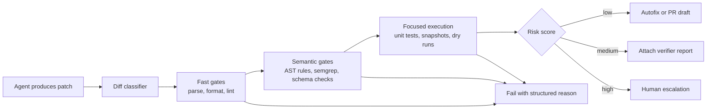

# Verifier Pipelines for AI Coding Agents That Catch Bad Edits Early

Shipping AI coding agents gets weird the moment a patch looks plausible enough to merge but quietly violates an invariant no reviewer noticed on first pass. Syntax still passes. The diff is small. The bug shows up two deploys later.

That is why I like verifier pipelines more than vague “review harder” advice. A good verifier pipeline turns model output into a series of cheap, inspectable gates: parse it, lint it, check policy, run focused tests, then escalate only when the patch crosses a risk threshold.

This post walks through a practical verifier pipeline for coding agents, with concrete stages, code, failure modes, and the places I would not trust a green check by itself.

## Why this matters

AI-generated patches fail differently than human-written ones. They are often locally coherent and globally wrong. A model can rename the right symbol in one file, miss the adjacent config, and still produce a very confident diff.

In production teams, the real problem is not “can the model write code.” It is “can we cheaply prove this patch did not break something important.” That means your verification stack needs to be narrower than full CI, faster than a human review cycle, and strict enough to stop the obvious bad edits before they waste reviewer attention.

Useful verifier pipelines usually solve four things at once:

- reject malformed edits fast
- catch semantic policy violations before PR review
- route risky patches to deeper checks or humans
- leave an audit trail explaining why a patch passed or failed

## Architecture and workflow overview



The key idea is staged cost. Do not spend integration-test money on a patch that already fails a parser check. Also do not send every harmless typo fix through a human gate if a deterministic verifier can explain why it is safe.

### Visual plan used for this post

- **Hero idea:** dark pipeline banner with lint, semgrep, and escalation stages
- **Diagram idea:** staged verifier flow from patch to PR or escalation
- **Terminal visual:** sample verifier report with pass/fail counts and risk score
- **Comparison table:** what each verifier stage catches, cost, and common blind spots
- **Tags:** AI Agents, Verification, Code Review, DevEx, Reliability
- **Code sections:** diff classification, staged verifier config, CI orchestration snippet

## Implementation details

### 1) Classify the patch before you verify it

The cheapest useful step is to classify what changed. File type, directory, edit size, and touched resources tell you whether the patch should go through documentation checks, API contract checks, migration checks, or a human stop sign.

```python
from dataclasses import dataclass
from pathlib import Path

@dataclass
class PatchProfile:
    files_changed: int
    touches_migrations: bool
    touches_auth: bool
    touches_tests_only: bool
    max_hunk_lines: int


def classify_patch(paths: list[str], hunks: list[int]) -> PatchProfile:
    suffixes = [Path(p).suffix for p in paths]
    return PatchProfile(
        files_changed=len(paths),
        touches_migrations=any('migrations/' in p or 'schema/' in p for p in paths),
        touches_auth=any('auth' in p or 'permissions' in p for p in paths),
        touches_tests_only=all('/test' in p or '/tests' in p or p.endswith('.spec.ts') for p in paths),
        max_hunk_lines=max(hunks, default=0),
    )
```

I like this because it gives the pipeline a reasoned starting point. A patch touching `auth/` plus a large hunk should not be treated like a README edit, even if both came from the same agent.

### 2) Define verifier stages as a small contract, not shell folklore

A lot of teams wire verification together as loose shell commands. That works until you need stable reporting, skip logic, or different lanes for high-risk files.

I prefer a compact config object that says what runs, when it runs, and what a failure means.

```yaml
stages:
  - id: parse-and-lint
    run: pnpm eslint . --max-warnings=0
    appliesWhen: ["*.ts", "*.tsx", "*.js"]
    severity: block
    timeoutSeconds: 45

  - id: auth-policy
    run: semgrep --config semgrep/auth-rules.yml .
    appliesWhen: ["**/auth/**", "**/permissions/**"]
    severity: block
    timeoutSeconds: 30

  - id: contract-tests
    run: pnpm vitest run tests/contracts
    appliesWhen: ["api/**", "schema/**"]
    severity: review
    timeoutSeconds: 90
```

This is boring in a good way. The agent can read it, CI can enforce it, and reviewers can audit it without guessing what “the safety script” currently does.

### 3) Use AST or structural rules where regex would lie to you

Regex-based checks are fine for a first pass, but they are brittle around refactors. For higher-signal checks, use syntax-aware rules. That can be [Semgrep](https://semgrep.dev/), tree-sitter, compiler APIs, or language-native analyzers.

Example: block new network calls inside a “pure transform” directory.

```yaml
rules:
  - id: no-network-in-transformers
    languages: [typescript]
    message: Transformer modules must stay side-effect free
    severity: ERROR
    paths:
      include:
        - src/transformers/**/*.ts
    patterns:
      - pattern-either:
          - pattern: fetch(...)
          - pattern: axios.$METHOD(...)
          - pattern: new Client(...)
```

This kind of rule catches a common agent failure mode: the model notices data is missing and “helpfully” adds a live API call in the wrong layer.

### 4) Produce a report that a human can scan in ten seconds

If the verifier passes or fails without context, reviewers still end up doing forensic work. The report should say what changed, what ran, what was skipped, and why the risk score landed where it did.

```text
$ verifier run patch-1842.diff

Patch profile: files=4, max_hunk=67, touches_auth=true

[PASS] parse-and-lint      12.4s
[PASS] unit-tests-auth     18.7s
[FAIL] auth-policy          2.1s
       rule=no-broad-admin-grant
       file=src/auth/grants.ts:44

Risk score: 0.86 (high)
Disposition: escalate-to-human
```

That output is not glamorous, but it is exactly what I want on a PR or agent trace. It explains the stop without making someone read raw CI logs first.

## Comparison table, what each stage is good at

| Stage | Catches well | Cheap? | Blind spots | Good default action |
| --- | --- | --- | --- | --- |
| Parse and format | broken syntax, import errors, formatter drift | Very cheap | semantic regressions | block immediately |
| Lint and typecheck | obvious API misuse, unused branches, bad types | Cheap to medium | runtime-only issues | block or autofix |
| AST or Semgrep policy | forbidden patterns, layer violations, auth drift | Medium | subtle business logic mistakes | block high-risk paths |
| Focused tests | regressions in touched flows | Medium to expensive | missing test coverage | attach report or block |
| Dry runs and snapshots | CLI, migrations, config output changes | Medium | hidden external effects | require review for risky diffs |
| Human escalation | weird edge cases, intent mismatch | Expensive | fatigue, inconsistency | reserve for high risk only |

## What went wrong, and the tradeoffs

### False confidence from green fast gates

The most common mistake is treating lint plus tests as proof. They are not proof. They are a filter. If your test suite does not cover the touched invariant, the pipeline will happily bless a bad patch.

### Overly broad policy rules

I have also seen teams add giant “security” rulesets that flag everything. Once developers expect noise, they stop trusting the pipeline. High-value rules should be narrow, path-aware, and attached to a specific failure reason.

### Cost creep from running everything on every patch

Verifier pipelines can become their own latency tax. If every tiny docs change triggers full contract tests, the system teaches people to bypass it. The classifier stage matters because it keeps expensive checks focused.

### Security concern, verifier execution is still code execution

This part matters. If an agent can propose test or build script changes, your verifier may end up executing model-written code. For risky repos, run verifiers in isolated containers, prefer read-only fixtures, and treat verifier logs as untrusted output if they ingest external content.

> **Pitfall:** Never let “the tests passed” be the only approval explanation for security-sensitive files. Auth, billing, infra, and migrations deserve path-specific rules and often a human checkpoint.

### What I would not do

I would not ship an autonomous coding agent that can edit production infra, run mutable deployment scripts, and auto-merge based only on generic unit tests. That setup looks efficient right up until the first plausible-looking outage.

## Practical checklist

Use this when adding a verifier pipeline to an existing coding-agent flow:

- classify diffs before choosing checks
- keep fast gates under one minute
- add path-aware policy rules for auth, billing, infra, and migrations
- prefer AST-aware checks over regex for important rules
- show skipped stages in the report, not just passed ones
- attach a risk score and disposition to every patch
- isolate verifier execution when tests can run changed code
- escalate only the weird or high-risk patches so humans stay sharp

## Direct references worth using

- [Semgrep](https://semgrep.dev/) for structural policy rules
- [tree-sitter](https://tree-sitter.github.io/tree-sitter/) for syntax-aware repo analysis
- [OpenTelemetry](https://opentelemetry.io/) if you want verifier stages and failures in the same trace as agent runs
- [GitHub Checks API](https://docs.github.com/en/rest/checks) for structured verifier feedback on pull requests

## Conclusion

The best verifier pipelines do not try to be magical. They turn AI patch review into a sequence of cheap, explainable gates, then spend human attention only where automation has low confidence. That is a much better posture than hoping a tidy diff means a safe change.
