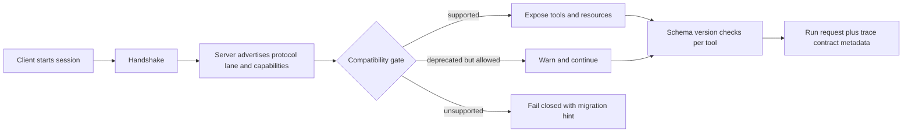

# Versioning MCP Servers Without Breaking Every Agent Client

MCP servers are easy to break in ways that look polite.

The server still starts. The tools still list. The client still connects. Then the agent calls a tool with one missing field, the approval UI cannot render a new capability flag, or an older desktop client silently ignores the negotiation hint you thought was optional.

That is the real upgrade problem. Most MCP breakage is not a dramatic crash. It is a compatibility drift that turns one server release into a lottery across editors, gateways, and agent runtimes.

This post covers a versioning pattern that has worked better for me: explicit protocol lanes, capability negotiation, schema version pins, deprecation windows, and handshake tests that fail before humans do.

## Why this matters

MCP is attractive because it lets one tool server talk to many clients. That multiplier is exactly why sloppy versioning hurts.

A server change can affect at least four things at once:

- the transport handshake
- tool and resource capability discovery
- input and output schemas
- the surrounding approval, tracing, and policy layer that depends on those contracts

If you only track a single semantic version for the whole server, you usually learn too late that one client only cared about tool schema compatibility while another broke because it expected a capability bit that disappeared.

## Architecture or workflow overview



A good rule is simple: negotiate once at session start, validate again at tool boundaries, and fail closed when the server cannot safely explain itself.

## Implementation details

### 1) Split protocol compatibility from tool contract compatibility

One version number is too coarse. I prefer a compatibility envelope with separate lanes for the session protocol, capability surface, and per-tool schema contracts.

```json
{
  "server": "deploy-tools",
  "serverVersion": "1.9.0",
  "protocolLane": "2026-04",
  "capabilities": {
    "tools": true,
    "resources": false,
    "approvals": true,
    "streamingToolResults": true
  },
  "toolContracts": {
    "github.create_pull_request": "2.1",
    "kubernetes.deploy": "3.0",
    "artifact.diff_bundle": "1.4"
  },
  "deprecations": [
    {
      "field": "kubernetes.deploy.input.cluster",
      "replacedBy": "target.clusterRef",
      "sunsetAfter": "2026-08-01"
    }
  ]
}
```

This gives the client enough information to answer three different questions:

1. Can I speak to this server at all?
2. Can I render and use the features it exposes?
3. Can I safely call each tool contract I care about?

### 2) Negotiate with deterministic gates, not prompt vibes

The runtime should make the compatibility decision before the model sees the tools.

```ts
interface HandshakeEnvelope {
  protocolLane: string;
  capabilities: Record<string, boolean>;
  toolContracts: Record<string, string>;
  deprecations: Array<{ field: string; replacedBy?: string; sunsetAfter: string }>;
}

const supportedProtocolLanes = new Set(['2026-02', '2026-04']);
const requiredCapabilities = ['tools', 'approvals'];

export function assertCompatible(env: HandshakeEnvelope) {
  if (!supportedProtocolLanes.has(env.protocolLane)) {
    throw new Error(`Unsupported MCP protocol lane: ${env.protocolLane}`);
  }

  for (const cap of requiredCapabilities) {
    if (!env.capabilities[cap]) {
      throw new Error(`Missing required capability: ${cap}`);
    }
  }

  const prContract = env.toolContracts['github.create_pull_request'];
  if (!prContract?.startsWith('2.')) {
    throw new Error(`Unsupported github.create_pull_request contract: ${prContract}`);
  }
}
```

The model should never have to infer whether the server is safe enough to use. That is adapter logic.

### 3) Deprecate fields with overlap windows and telemetry

The dangerous move is deleting fields the moment a cleaner contract exists. That works in one repo and explodes in mixed-client fleets.

A safer pattern is:

- add the new field first
- keep the old field for one or two release windows
- log old-field usage with client identifiers
- refuse removal until usage falls to zero or the deadline is explicit and communicated

```ts
export function normalizeDeployInput(input: any, clientName: string) {
  if (input.cluster && !input.target?.clusterRef) {
    console.warn('deprecated_field_used', {
      clientName,
      field: 'cluster',
      replacement: 'target.clusterRef'
    });

    input.target = { ...input.target, clusterRef: input.cluster };
  }

  return input;
}
```

This looks boring, which is the point. Compatibility work should be operationally boring.

### 4) Run handshake tests like API contract tests

If your CI only tests happy-path tool behavior, you will miss most upgrade regressions.

Terminal snapshot tests are cheap insurance:

```bash
$ node scripts/check-handshake.js --client cursor-1.8 --server http://localhost:3000
✔ protocol lane 2026-04 supported
✔ required capabilities present: tools, approvals
✔ github.create_pull_request contract matches 2.x
⚠ deprecated field kubernetes.deploy.input.cluster still accepted until 2026-08-01

$ node scripts/check-handshake.js --client old-gateway --server http://localhost:3000
✖ protocol lane 2025-12 expected, server advertises 2026-04
hint: upgrade gateway adapter or pin server deploy-tools@1.8.x
```

I would test at least one newest client, one lagging client, and one intentionally unsupported client so fail-closed behavior stays honest.

## What went wrong and the tradeoffs

### The easy mistake, semantic versioning by itself

A plain `2.0.0` server tag tells humans something changed, but it does not tell clients what changed. Handshake metadata and per-tool contracts carry the useful detail.

### The opposite mistake, per-field chaos

You can also overdo it and invent too many tiny version numbers. That creates bookkeeping nobody trusts.

| Approach | Benefit | Cost | When I would use it |
| --- | --- | --- | --- |
| Single server semver only | Minimal overhead | Hides incompatible surface changes | Small internal prototypes |
| Protocol lane plus per-tool contracts | Good balance of clarity and effort | Needs discipline in adapters and CI | Shared MCP servers used by many clients |
| Version every field separately | Maximum precision | Operationally annoying | Rarely worth it |

### Failure mode, capability drift outside the handshake

I have seen teams add approval or streaming behavior in the tool description text but forget to publish it in the handshake envelope. That creates a bad split-brain state where the model knows more than the runtime UI.

> **Pitfall:** if a capability changes client behavior, put it in machine-readable negotiation data, not only in prose.

### Security and reliability concern

Compatibility logic is part of the trust boundary. If a proxy or plugin can rewrite capability flags in transit, it can trick clients into enabling flows they do not actually support.

What I would do:

- terminate negotiation at a trusted adapter, not deep inside prompt text
- trace the negotiated protocol lane and tool contract versions
- bind approval UI behavior to the same contract metadata the executor enforces
- reject unknown write-tool contract majors by default

### What I would not do

I would not let the model dynamically decide that `2.x` is close enough to `3.x` for a write tool. That kind of optimism belongs nowhere near deployments, PR creation, or anything with side effects.

## Practical checklist

- [ ] publish a handshake envelope with protocol lane, capabilities, and per-tool contract versions
- [ ] separate transport compatibility from tool schema compatibility
- [ ] add deprecation windows instead of deleting fields immediately
- [ ] log deprecated field usage by client name and version
- [ ] trace negotiated contract metadata on every session
- [ ] test newest, lagging, and unsupported clients in CI
- [ ] fail closed on unknown major versions for write tools
- [ ] keep migration hints human-readable in rejection errors

> **Best practice:** the compatibility story is not done until an older client fails with a clear migration hint instead of a vague tool error three steps later.

## Conclusion

The best MCP versioning scheme is the one that turns upgrades into routine maintenance instead of archaeology.

Separate the handshake from the tool contracts, keep deprecations visible, and test compatibility like a real interface. Your future client fleet will thank you.

## References

- [Model Context Protocol documentation](https://modelcontextprotocol.io)
- [Semantic Versioning 2.0.0](https://semver.org/)
- [JSON Schema](https://json-schema.org/)
- [OpenTelemetry](https://opentelemetry.io/)
