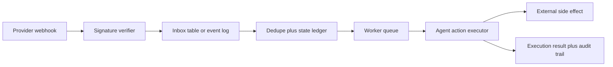

# Webhook Inboxes for AI Agents That Do Not Duplicate Side Effects

Most webhook bugs are boring until they become expensive. A provider retries because your endpoint took too long, your AI worker processes both deliveries, and suddenly the same callback opens two tickets, sends two emails, or triggers the same repo job twice.

This gets worse in agent systems because the callback usually leads to side effects, not just a database write. A duplicate payment event might cause a human-visible message, a tool run, or a state transition that is annoyingly hard to roll back.

The fix is not "retry less." The fix is to treat webhook intake like a durable inbox. Verify the sender, store the raw event, assign an idempotency key, and let workers process a ledgered event exactly once.

## Why this matters

If your agent stack touches GitHub, Stripe, Slack, CI, or internal async jobs, you already depend on callback delivery that is at-least-once, occasionally delayed, and sometimes out of order. Building direct side effects into the HTTP handler is the fastest path to subtle production damage.

What you want instead:

- a fast intake path that only authenticates and persists
- a durable event ledger with dedupe state
- a worker path that can retry safely
- observability that tells you whether a replay was malicious, legitimate, or self-inflicted

## Architecture or workflow overview



Numbered sequence:

1. Accept the webhook and capture the raw body exactly as delivered.
2. Verify signature, timestamp, and expected source.
3. Derive a stable dedupe key from provider event ID or signed headers.
4. Write the event to an inbox ledger before doing agent work.
5. Ack the provider quickly.
6. Let a worker claim the event, run policy checks, and execute the agent side effect.
7. Record completion, failure, or dead-letter state with enough evidence to replay safely.

## Implementation details

### 1) Verify first, store second, execute later

A good handler does very little. It checks authenticity, writes one durable record, and returns 202 or 200 quickly.

```ts
import crypto from "node:crypto";
import express from "express";
import { db } from "./db";

const app = express();
app.use(express.raw({ type: "application/json" }));

function verifySignature(rawBody: Buffer, sigHeader: string, secret: string) {
  const expected = crypto
    .createHmac("sha256", secret)
    .update(rawBody)
    .digest("hex");

  return crypto.timingSafeEqual(
    Buffer.from(expected),
    Buffer.from(sigHeader.replace("sha256=", ""))
  );
}

app.post("/webhooks/agent-events", async (req, res) => {
  const rawBody = req.body as Buffer;
  const signature = req.header("x-signature") ?? "";
  const providerEventId = req.header("x-event-id") ?? "missing";

  if (!verifySignature(rawBody, signature, process.env.WEBHOOK_SECRET!)) {
    return res.status(401).send("invalid signature");
  }

  await db.webhookInbox.insert({
    dedupeKey: providerEventId,
    provider: "example-provider",
    rawBody: rawBody.toString("utf8"),
    receivedAt: new Date(),
    status: "received"
  }).onConflict("dedupe_key").ignore();

  return res.status(202).send("accepted");
});
```

What I like about this pattern is that it keeps the handler boring. That is a compliment. The HTTP edge should not open PRs, call models, or send chat messages.

### 2) Claim work through a ledger, not a boolean flag

A single `processed=true` column sounds fine until retries, worker crashes, and manual replays show up. Use explicit states and lease-style claiming instead.

```sql
create table webhook_inbox (
  id bigserial primary key,
  provider text not null,
  dedupe_key text not null,
  status text not null check (status in ('received', 'processing', 'done', 'failed', 'dead_letter')),
  raw_body jsonb not null,
  attempt_count integer not null default 0,
  claimed_by text,
  claimed_until timestamptz,
  received_at timestamptz not null default now(),
  processed_at timestamptz,
  last_error text,
  unique (provider, dedupe_key)
);

update webhook_inbox
set
  status = 'processing',
  claimed_by = $1,
  claimed_until = now() + interval '2 minutes',
  attempt_count = attempt_count + 1
where id = (
  select id
  from webhook_inbox
  where status in ('received', 'failed')
     or (status = 'processing' and claimed_until < now())
  order by received_at asc
  for update skip locked
  limit 1
)
returning *;
```

This gives you safe recovery after crashes and stops two workers from racing the same event.

### 3) Make side effects idempotent too

Inbox dedupe is necessary, but it is not sufficient. If the worker opens a GitHub issue or sends a Slack message, that downstream operation should also carry a stable idempotency key.

```python
from dataclasses import dataclass

@dataclass
class ActionContext:
    dedupe_key: str
    run_id: str

async def send_agent_notification(client, channel_id: str, text: str, ctx: ActionContext):
    return await client.post(
        "/messages",
        json={
            "channel": channel_id,
            "text": text,
            "idempotency_key": f"notify:{ctx.dedupe_key}"
        },
        timeout=10,
    )
```

### Terminal view I actually want during an incident

```text
$ webhookctl inbox inspect evt_01JX9M9M7S7
provider       example-provider
status         failed
attempt_count  3
dedupe_key     evt_01JX9M9M7S7
claimed_until  expired 41s ago
last_error     GitHub API 502 during issue creation
next_action    retry-safe, side effect not committed
```

That kind of output helps an operator decide whether to replay, pause, or dead-letter. A flat log stream usually does not.

## What went wrong, and the tradeoffs

### The easy failure mode: signature checks on parsed JSON

A surprising number of webhook implementations verify a re-serialized JSON body instead of the raw bytes. That breaks legitimate signatures and creates confusing intermittent failures when whitespace or key ordering changes.

### The more dangerous failure mode: "we already dedupe in Redis"

Redis can be fine as a cache or coordination layer, but using an expiring key as your only source of truth is fragile for anything that triggers meaningful side effects. You lose auditability, replay context, and confidence during incident response.

### Ordering is often weaker than teams assume

Some providers give strong event IDs but weak ordering guarantees. If your agent action depends on sequence, the inbox has to model that explicitly. For example, a `job.completed` callback arriving before `job.started` should not cause state corruption.

### Security concern: replays are not always duplicates

A valid signature can still be replayed by an attacker or by a misconfigured intermediary if you do not enforce timestamp windows, nonce tracking, or provider event uniqueness. Signature verification proves origin, not freshness.

## Tradeoff table

| Pattern | Good at | Weak at | When I would use it |
| --- | --- | --- | --- |
| Direct handler side effects | Lowest latency | Duplicates, poor recovery, weak audit trail | Almost never for agent workflows |
| Inbox table + worker queue | Reliability, replay safety, ops visibility | Slightly more system complexity | Default choice |
| Kafka or log-based event intake | High scale, fan-out, retention | More infra and sharper ops edges | Multi-team platforms or very high throughput |
| Redis dedupe only | Cheap temporary suppression | Weak evidence, TTL footguns | Only as a secondary optimization |

## Pitfalls and best-practices

> **Pitfall:** acknowledging only after agent work completes.  
> This invites provider retries during slow model or tool calls and turns one logical event into many deliveries.

> **Best practice:** acknowledge after durable intake, not after business completion.  
> Your worker path should own retries, backoff, and dead-letter policy.

> **What I would not do:** use one global retry policy for every webhook source.  
> Payment events, CI callbacks, and chat platform interactions usually need different TTLs, operator alerts, and replay rules.

## Practical checklist

- [ ] Verify signatures against the raw request body
- [ ] Enforce a timestamp skew limit or replay window
- [ ] Persist each event before side effects begin
- [ ] Use a unique provider plus event ID dedupe key
- [ ] Lease work to workers instead of toggling a boolean flag
- [ ] Carry idempotency keys into downstream side effects
- [ ] Record terminal states: done, failed, dead-letter
- [ ] Expose operator-friendly inspect and replay tooling
- [ ] Keep the original payload for audit and debugging
- [ ] Alert on repeated failures, not just first failure

## Conclusion

Webhook reliability for AI agents is mostly about refusing to do too much at the edge. Build a small authenticated intake path, persist everything that matters, and let workers own retries and side effects. It is a little more plumbing up front, but it is dramatically cheaper than explaining duplicate agent actions after the fact.
